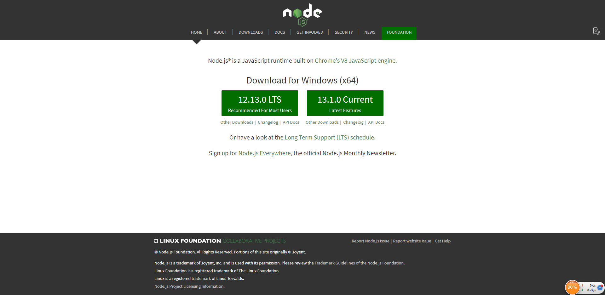
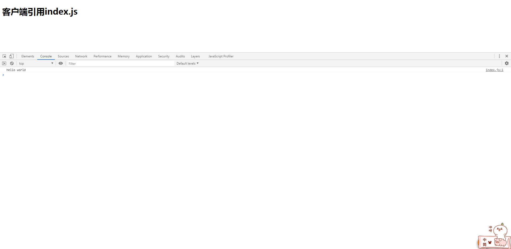
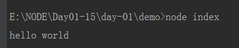

# 安装node环境

> 安装
* 去[官网](https://nodejs.org/en/)下载
* 官网会根据操作系统智能识别，这里我用的是windows，所以映入眼帘的是

    
    
* 左边的LTS为稳定版，推荐下载稳定版
* 右边的是最新版本，不建议使用最新版本
* 下载后傻瓜是安装即可，然后通过cmd，输入指令`node -v`能看到版本信息就说明安装成功了
* [补充-淘宝镜像 ](https://npm.taobao.org/)  

> 练习
* 我们先新建个index.js，里面就随意写行打印语句

* 如果在页面中打开，这个就是客户端运行，就是我们前端经常做的事情，具体操作如下
    1. 新建个index.html
    2. 在页面中引用index.js
    3. 具体代码如下
        ```html
        <!DOCTYPE html>
        <html lang="en">
        <head>
            <meta charset="UTF-8">
            <title>Title</title>
        </head>
        <body>
        <h1>客户端引用index.js</h1>
        <script src="./index.js"></script>
        </body>
        </html>
        ```
    4. 截图如下
    
            
        
* 如何在服务端node环境执行index.js，具体操作如下
    1. 打开终端,进入到index.js对应的目录
    2. 执行`node index`,这里**index.js**的**.js**可以省略
    3. 截图如下
    
        
        
> 知道你不过瘾继续吧

* [目录](../../README.md)
* [下一篇-本地搭服务器](../day-02/01-本地搭服务器.md)
  
        
        
    
        
            