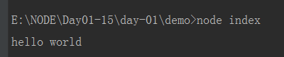

# 安装node环境

> 知识大纲
* 去[官网](https://nodejs.org/en/)下载
* 官网会根据操作系统智能识别，这里我用的是windows，所以映入眼帘的是

    
    
* 左边的LTS为稳定版，推荐下载稳定版
* 右边的是最新版本，不建议使用最新版本
* 下载后傻瓜式安装即可，然后通过cmd，输入指令`node -v`能看到版本信息就说明安装成功了
* [补充-淘宝镜像](https://npm.taobao.org/),`npm install -g cnpm --registry=https://registry.npm.taobao.org`,
    这是一个完整 npmjs.org 镜像，你可以用此代替官方版本(只读)，同步频率目前为 10分钟 一次以保证尽量与官方服务同步。 
    
* 使用cnpm的原因是   

      
    
* yarn包管理工具 `npm install -g yarn`

    
    
* 使用NVM（Node Version Manager）控制Node.js版本 

    * Nvm-windows  [下载地址](https://github.com/coreybutler/nvm-windows) 下载nvm-setup.zip

* NVM常用指令
    * ``nvm --version查看版本``
    * ``nvm install stable //安装最新稳定版nodejs``
    * ``nvm install 8.11.1  //安装指定版本``
    * ``nvm install 8.11     //安装 8.11.x系列最新版本``
    * ``nvm ls-remote      //列出远程服务器上所有可用的版本``
    * ``nvm use 8.11.1    //切换到8.11.1版本``
    * ``nvm use 8.11      //切换到8.11.x最新版本``
    * ``nvm use node   //切换到最新版本``
    * ``nvm alias default node //设置默认版本为最新版本``
    * ``nvm ls   //列出所有已经安装的版本``     
        
    

> 练习
* 我们先新建个index.js，里面就随意写行打印语句

* 如果在页面中打开，这个就是客户端运行，就是我们前端经常做的事情，具体操作如下
    1. 新建个index.html
    2. 在页面中引用index.js
    3. 具体代码如下
        ```html
        <!DOCTYPE html>
        <html lang="en">
        <head>
            <meta charset="UTF-8">
            <title>Title</title>
        </head>
        <body>
        <h1>客户端引用index.js</h1>
        <script src="./index.js"></script>
        </body>
        </html>
        ```
    4. 截图如下
    
            
        
* 如何在服务端node环境执行index.js，具体操作如下
    1. 打开终端,进入到index.js对应的目录
    2. 执行`node index`,这里**index.js**的.js可以省略
    3. 截图如下
    
        
        
> 知道你不过瘾继续吧

* [目录](../../README.md)
* [下一篇-本地搭服务器](../day-02/本地搭服务器.md)
  
        
        
    
        
            