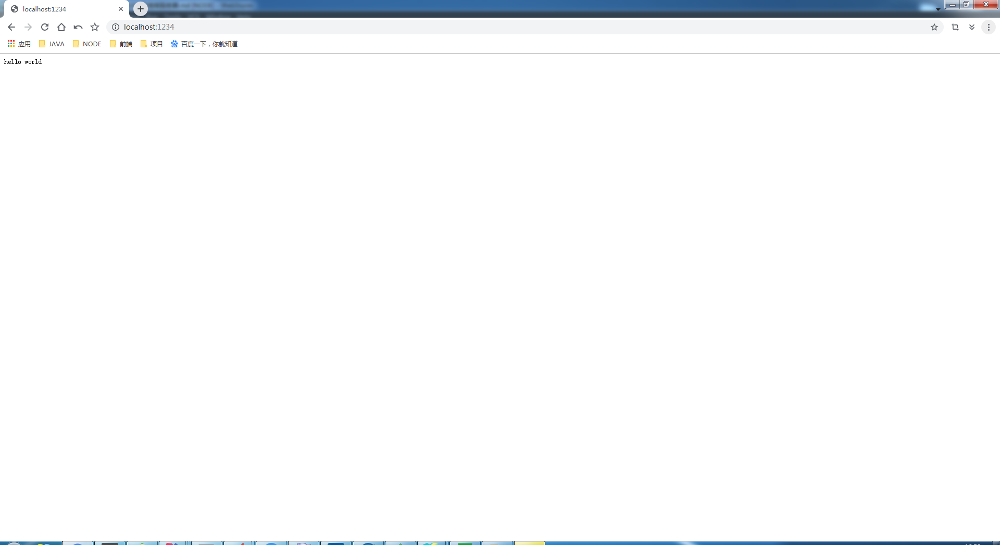

# 本地搭服务器

> 知识大纲
* http模块
* [全局安装nodemon](https://www.jianshu.com/p/3b3b8bf9c4e9), `cnpm install -g  nodemon`

> 练习
1. 这次我们新建一个js，取名为**http.js**
2. 使用http模块，本地搭建服务器
    ```javascript
    const http = require("http");
    
    const server = http.createServer((req, res) => {
        res.write("hello world");
        res.end();
    });
    
    server.listen(1234);
    ```
3. 上述代码就是使用了http模块，创建了server，方法里的参数req，
    res表示请求**request**，响应**response**  
4. 方法体内，write代表像页面输出字符串**hello world**，`res.end();` 
    简单说就是如果服务端没有数据传回客户端就可以直接用red.end返回    
5. 最后`server.listen(1234);`指的是监听哪个端口号
6. 在node环境执行http.js,`node http`，执行后终端没有任何信息也没有报错，说明已经开启服务器
7. 所以之后我们可以在本地浏览器打开**http://localhost:1234/**     

    

8. 我们能在页面上看到**hello world**,此时如果我们想把hello world改成hello node，记得需要重启服务器，
    如果直接刷新浏览器是没有用的 
9. 重启的方式在终端按**Ctrl+C**，退出后在执行`node http`
10. 我们发现每次这样操作都比较繁琐，所以这里我们可以安装nodemon，通过nodemon去启动，`nodemon http`,
    他是Node自动重启工具   
11. 这样我们就可以随意修改，保存后直接刷新浏览器就可以了    

> 知道你不过瘾继续吧

* [目录](../../README.md)
* [上一篇-安装node环境](../day-01/01-安装node环境.md)