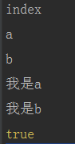

# 模块化

> 知识大纲
* **require("xxxx")**, 是nodejs中模块化引入模块的语法
* 模块化的好处 - 每个文件为一个模块，不用担心变量污染

> 练习
1. 我们先新建3个js文件，**index**，**a**，**b**, 分别打印index，a，b
2. 然后在index中通过require模块a和b，然后在node环境下执行index，这里贴出index的代码，a和b的代码就只有一条打印语句
    ```
    console.log("index");
    
    require("./a");
    require("./b");
    ```
3. 执行后就能看到打印了index, a, b
4. 我们分别给a和b定义相同的变量test
    * a中写`let test = "我是a";`    
    * b中写`let test = "我是b";`   
5. 通过模块导出,这里我们使用2种不同的写法，记住**exports**是**module.exports**的引用,
    即`console.log(module.exports === exports); //这个就是true`
6. 下面的写法是等价的，切记不能写**exports = {a, b}**
    ```
    let a = "a";
    let b = "b";
    module.exports = {
        a,
        b
    }
    ```
    ```
    let a = "a";
    let b = "b";
    exports.a = a;
    exports.b = b;
    ```   
7. 所以我们现在的三个文件a,b,index的代码分别是
    ```
    console.log("a");
    
    let test = "我是a";
    
    module.exports = {
        test
    };
    ```     
    ```
    console.log("b");
    
    let test = "我是b";
    exports.test = test;
    ```
    ```
    console.log("index");
    
    let a = require("./a");
    let b = require("./b");
    console.log(a.test);
    console.log(b.test);
    
    console.log(module.exports === exports);
    ```
8. 执行index后,就能看到这样的打印结果

     
    
9. 模块之间也可以require，就像index里引入了a和b两个模块   

> 知道你不过瘾继续吧
* [目录](../../README.md)
* [上一篇-本地搭服务器](../day-02/本地搭服务器.md)