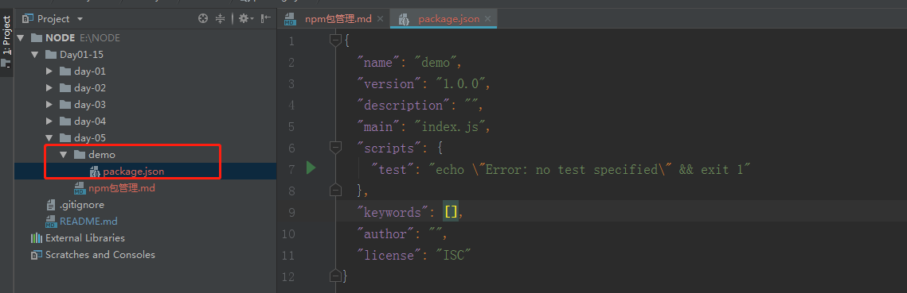
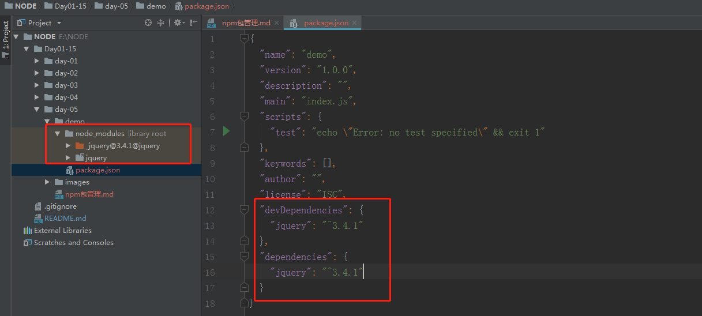

# npm包管理
> 知识大纲
* **npm:包管理器**
* 一般第三方的都会放在node_modules
* 引用的模块没找到会依次往上找
* [官方网址](https://www.npmjs.com/),大佬们会把写的好的模块上传，然后我们可以通过`npm i xxxx`去安装
* 指令的一些细节
    * i是install 的简写
    
    * -S就是--save的简写
    
    * -D就是--save-dev的简写 
    
    * -D会存在package.json的devDependencies这个里面，而-S会将包的名称及版本号放在dependencies里面。
    
    * 那package.json文件里面的 devDependencies和dependencies对象有什么区别呢？
    
    * devDependencies里面的插件只用于开发环境，不用于生产环境，而dependencies是需要发布到生产环境的。
        
> 回顾
1. `const http = require("http");`，这段代码在之前本地搭建服务器的时候我们已经用过了
2. **http**我们会发现根本没在我们建的项目里，甚至我们的项目中node_modules都没有，但依然没有报错
3. 因为http模块是内置模块，官方的模块，我们在安装node的时候就已经安装上了, 可以使用这个指令`npm root -g`官方模块位置

> 练习
1. 我们老样子新建一个demo文件，然后cd到这个路径下
2. 我们使用`cnpm init -y`先初始化下，-y是默认选项都是yes
    这样能在demo文件夹下生成我们的package.json文件

    
    
3. 我们使用`cnpm i jquery -D`和`cnpm i jquery -S`安装下第三方的模块,然后看下package.json
    
    
    
4. 我们会发现，安装完成后，我们项目中就多了node_modules的文件了，并且根据不一样的参数,package.json也是不一样的，
    其实不难理解，有的模块就是开发的时候用到生产的时候用不到，所以要加上-D,
    有的模块就是开发和生产都会用到，所以要加上-S
    
5. 我们可以根据自己的需要选择安装第三方模块    
6. 提交的源码项目，应该不会把node_modules里的模块都提交上去，所以在跑项目前，需要先执行npm i，把需要的依赖都下下来

> 知道你不过瘾继续吧
* [目录](../../README.md)
* [上一篇-node_modules](../day-04/node_modules.md)
* [下一篇-npm常用指令](../day-06/npm常用指令.md)