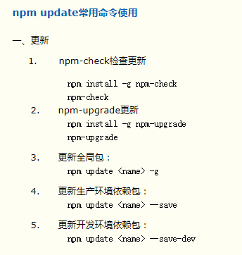

# npm常用指令

> 知识大纲
* 回顾
    1. 安装第三方模块，`cnpm i xxxx`
    2. 运行依赖(-S)和开发依赖(-D)
        * 这里举几个例子
        * 开发依赖 - sass等
        * 运行依赖 - axios等

    3. -g指令是全局安装
* 删除安装的模块，`cnpm uninstall xxxx` 
* 更新安装的模块，这里没有实际操作过，先贴一张截图，后续再试   

    

> 知道你不过瘾继续吧
* [目录](../../README.md)
* [上一篇-npm包管理](../day-05/npm包管理.md)
* [下一篇-文件操作](../day-07/文件操作.md)