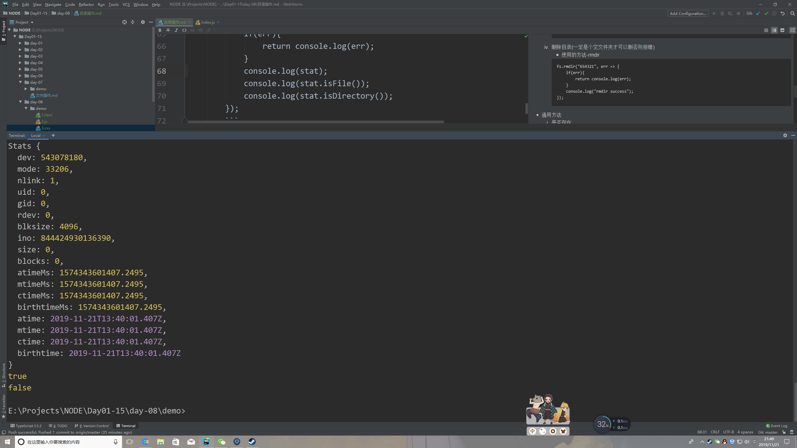

# 目录操作
> 知识大纲
* 上一章fs模块针对的是文件操作
* 这次我们依然使用fs模块对目录进行操作，目录也可以理解为文件夹
* 所有的目录操作没有加sync都是异步操作，否则是同步，这个和文件操作是一样的
* 讲解文件和目录的通用方法
    1. 是否存在 - exists
    2. 读取文件或者目录的详细信息 - stat

> 练习
* 目录操作
    1. 创建目录
        * 使用的方法-mkdir
        ```
        fs.mkdir("123456", err => {
            if(err){
                return console.log(err);
            }
            console.log("mkdir success");
        });
        ```
    2. 修改目录名称  
        * 使用的方法-rename
        ```
        fs.rename("123456", "654321", err => {
            if(err){
                return console.log(err);
            }
            console.log("rename success");
        });
        ``` 
    3. 读取目录   
        * 使用的方法-readdir,注意这里就读取就这个文件夹下的文件和文件夹，返回一个数组，
            如果要读取一个文件夹下所有的文件需要结合是否是文件夹的api在加上递归
        ```
        fs.readdir("../../../../NODE", (err, data) => {
            if(err){
                return console.log(err);
            }
            console.log(data); //[ '.git', '.gitignore', '.idea', 'Day01-15', 'README.md' ]
        });
        ```
    4. 删除目录(一定是个空文件夹才可以删否则报错)
        * 使用的方法-rmdir
        ```
        fs.rmdir("654321", err => {
            if(err){
                return console.log(err);
            }
            console.log("rmdir success");
        });
        ```
* 通用方法    
    1. 是否存在
        * 使用的方法-exists 
        ```
        fs.exists("1.html", flag => {
            console.log(flag);
        });
        ```  
    2. 详细信息
        * 使用的方法-exists 
        ```
        fs.stat("2.js", (err,stat) => {
            if(err){
                return console.log(err);
            }
            console.log(stat);
            console.log(stat.isFile());
            console.log(stat.isDirectory());
        });
        ```  
       
        

> 知道你不过瘾继续吧
* [目录](../../README.md)
* [上一篇-文件操作](../day-07/文件操作.md)