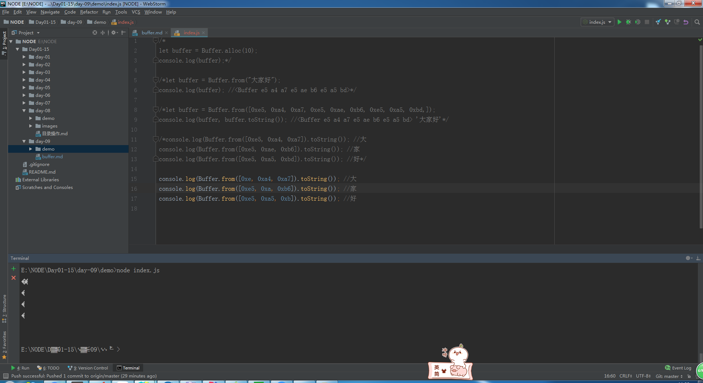
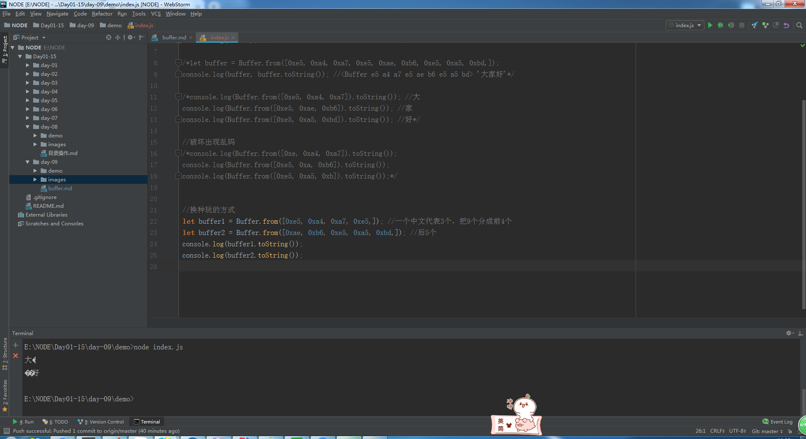

# buffer

> 知识大纲
* 之前文件读取，如果没有指定编码**UTF-8**,就会返回buffer数据
* 这章我们就来了解下什么是buffer
* buffer是一种数据格式
* 手动创建buffer;

> 练习
1. 通过Buffer.alloc创建个buffer
    ```
    let buffer = Buffer.alloc(10);
    console.log(buffer); //<Buffer 00 00 00 00 00 00 00 00 00 00>
    ```
2. 通过字符串创建   
    ```
    let buffer = Buffer.from("大家好");
    console.log(buffer); //<Buffer e5 a4 a7 e5 ae b6 e5 a5 bd>
    ``` 
3. 通过数组创建    
    ```
    let buffer = Buffer.from([0xe5, 0xa4, 0xa7, 0xe5, 0xae, 0xb6, 0xe5, 0xa5, 0xbd,]);
    console.log(buffer, buffer.toString()); //<Buffer e5 a4 a7 e5 ae b6 e5 a5 bd> '大家好'
    ```
    
4. 上述demo，我们不难发现，1个中文对应的3个，也就是说
    * 大 - e5 a4 a7
    * 家 - e5 ae b6
    * 好 - e5 a5 bd   

5. 我们可以通过代码来测试下  
    ```
    console.log(Buffer.from([0xe5, 0xa4, 0xa7]).toString()); //大
    console.log(Buffer.from([0xe5, 0xae, 0xb6]).toString()); //家
    console.log(Buffer.from([0xe5, 0xa5, 0xbd]).toString()); //好
    ```    
6. 如果我们对其进行**破坏**,就会有乱码
    
       
    
7. 第二次调戏代码

        
 
8. 我们可以通过Buffer.concat恢复原状！
    ```javascript
    //换种玩的方式
    let buffer1 = Buffer.from([0xe5, 0xa4, 0xa7, 0xe5,]); //一个中文代表3个，把9个分成前4个
    let buffer2 = Buffer.from([0xae, 0xb6, 0xe5, 0xa5, 0xbd,]); //后5个
    console.log(buffer1.toString()); //乱码
    console.log(buffer2.toString()); //乱码
    
    let newBuffer = Buffer.concat([buffer1, buffer2]);
    console.log(newBuffer.toString()); //大家好
    ```  
    
9. 通过内置模块string_decoder中的StringDecoder  
    ```javascript
    const {StringDecoder} = require("string_decoder");
    let buffer1 = Buffer.from([0xe5, 0xa4, 0xa7, 0xe5,]);
    let buffer2 = Buffer.from([0xae, 0xb6, 0xe5, 0xa5, 0xbd,]);
    let decoder = new StringDecoder();
    let res1 = decoder.write(buffer1); //大
    let res2 = decoder.write(buffer2); //家好
    console.log(res1);
    console.log(res2);
    ```
  

> 知道你不过瘾继续吧
* [目录](../../README.md)
* [上一篇-目录操作](../day-08/目录操作.md)
* [下一篇-stream流](../day-10/stream流.md)