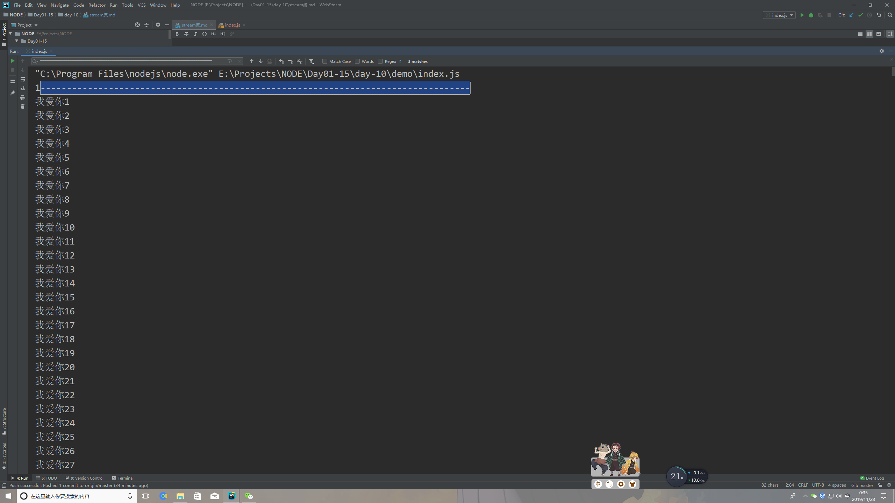
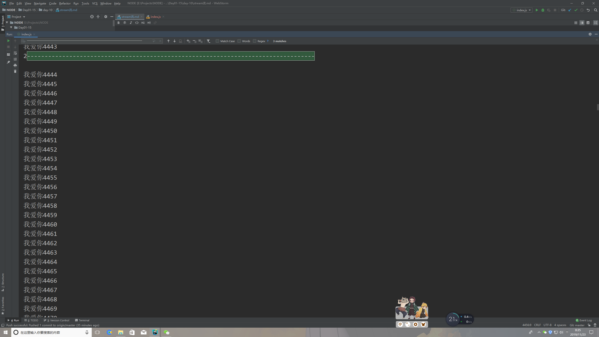
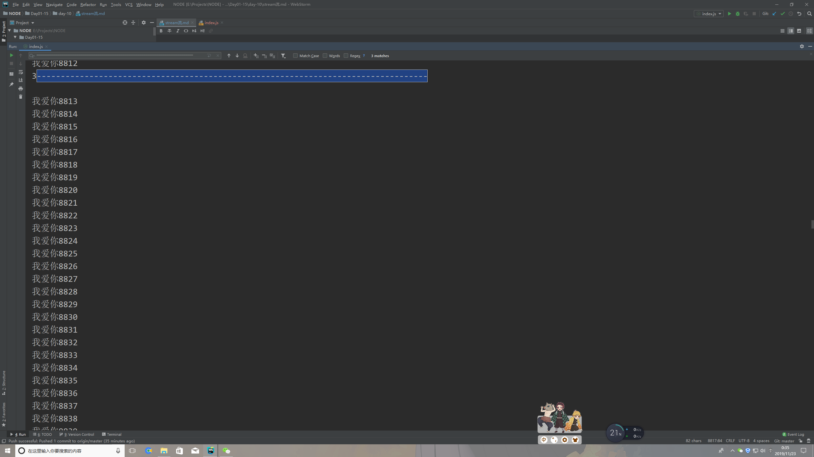

# stream流

> 知识大纲
* 数据过大文件过大的传输问题
* 像流水一样依次传递
* 本质把文件数据切分成很多份传输
* 流会把数据分成64kb的小文件传输

> 练习
1. 我们先来创建个稍微大点的文件吧
    ```
    //写一万句我爱你
    let showLove = [...".".repeat(10000)].map((item,index) => `我爱你${index+1} \n`).join("");
    fs.writeFileSync("mylove.txt", showLove, err => {
        if(err){
            return console.log(err);
        }
        console.log("写入成功");
    });
    ```
2. 我们先用fs.readFile去读这个文件,打印出来的就是我们的一万句我爱你
    ```
    //使用fs.readFile去读
    fs.readFile("mylove.txt", (err,data) => {
        if(err){
            return console.log(err);
        }
        console.log(data.toString());
    });
    ``` 
3. 然后我们来看下流的表现
    ```
    //使用stream去读
    let num = 0;
    let str = "";
    let rs = fs.createReadStream("myLove.txt");
    rs.on("data", chunk => {
        num++;
        str += chunk;
        console.log(num + "----------------------------------------------------------------------------------");
        console.log(chunk.toString());
    });
    rs.on("end", () => {
        console.log(str);
    });
    ``` 

4. 这里要解释下
    1. num用来计数，来看下切分了几次
    2. str为最终返回的所有的数据，这就是这个稍微大点的文件所有的文字
    3. rs就是我们创建的读的流，api是`fs.createReadStream(path)`,传入的参数就是我们的文件路径
    4. `rs.on(:data",()=>{})`就是每次读取一小块文件的时候触发，所以我们在内部，让他`num++`，并且`str+=chunk`     
    5. `rs.on("end",()=>{})`就是文件读完后触发
    
5. 我们来看下打印的结果 

      
     
     
      
       
   
6. 很明显文件被拆成了3次读取，最终返回的还是一万次我爱你~
7. 如何证明**流会把数据分成64kb的小文件传输**
    1. 我们可以创建一个65kb的文件，一个64kb的文件,这里演示下代码
        ```
        //创建一个65kb的文件
        let buffer = Buffer.alloc(65 * 1024);
        fs.writeFileSync("test.txt", buffer);       
        ```
    2. 然后分别通过读流去看
    3. 然后就会发现64kb的一下子就读好了，都没切片
    4. 65kb的，毒瘤就分了2次读       

8. 说了读流(dl = 毒瘤)在来看下写流(xl = 下流),哈哈冷笑话一下，大家不要介意
    ```
    //写的流这个相当于复制的写法
    let ws = fs.createWriteStream("trueLove.txt");
    rs.pipe(ws);
    ```   
9. 上述代码，通过`rs.pipe(ws);`就写出了我们的trueLove.txt,也是10000行我爱你,
    相当于一个复制操作
10. 流的概念基本就这样，运用的场景比如上传文件后读取文件啊之类的         

> 知道你不过瘾继续吧
* [目录](../../README.md)
* [上一篇-buffer](../day-09/buffer.md)