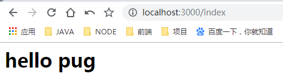
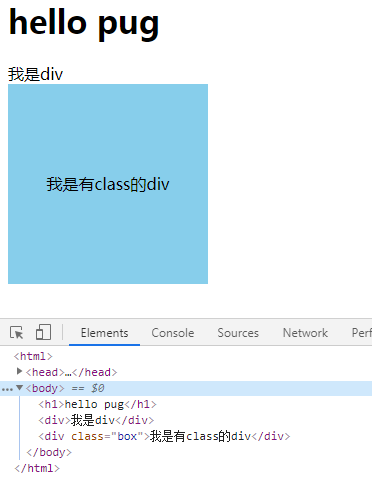
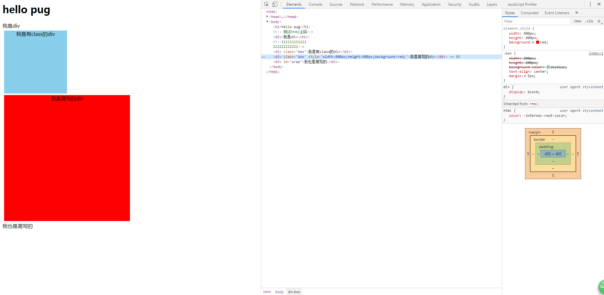
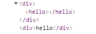
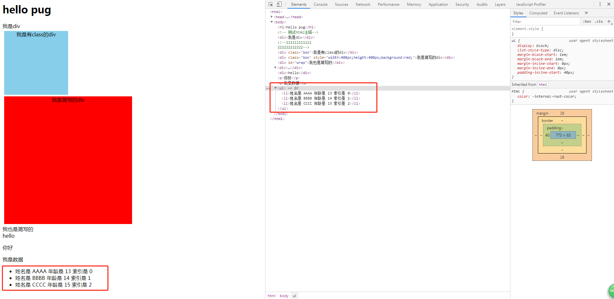

# pub模板引擎
> 知识大纲
* 模板引擎 - web应用中动态生成html的工具
* 本章介绍的是pug模板，原名是jade

> 练习
1. 在demo下初始化package.json, `cnpm init -y`
2. 安装下我们需要的模块，这里用到koa的一些模块,后续会补充相关知识,使用
    ```
    cnpm i koa koa-router koa-views pug
    ```
3. 在demo下新建一个**index.js** 
4. 在index中注入灵魂
    ```
    const Koa = require("koa");
    const Router = require("koa-router");
    const views = require("koa-views");
    
    let app = new Koa(); //实例化koa
    let router = new Router(); //后端路由
    //指定模板引擎页面放在哪个目录下，使用的是hug模板
    app.use(views(__dirname + "/views", {
        map: {
            html: "hug"
        }
    }));
    //路由
    router.get("/", async ctx => {
        ctx.body = "hello koa";
    });
    router.get("/index", async ctx => {
        ctx.body = "index";
    });
    router.get("/detail", async ctx => {
        ctx.body = "detail";
    });
    
    app.use(router.routes());//使用路由
    app.listen(3000);//监听3000端口

    ```  
5. 启动node,分别访问**http://localhost:3000/**, **http://localhost:3000/index**, 
    **http://localhost:3000/detail**,就能看到展示不一样的页面   
    
6. 在demo下新建个文件夹取名为views，这个就是我们前面设置的views路径  
7. 新建个index.pug,编写代码，如下所示
    ```
    html
        head
            title TEST-PUG
        body
            h1 hello pug
    ```
8. index.js中用此模板    
    ```
    router.get("/index", async ctx => {
        await ctx.render("index.pug");
    });
    ```
9. 然后访问**http://localhost:3000/index**，就能看到   
    
     
    
10. 修改index.pug模板，观察语法， 观察页面
    ```
    html
        head
            title TEST-PUG
            style.
                .box{
                    width: 200px;
                    height: 200px;
                    background-color: skyblue;
                    text-align: center;
                    line-height: 200px;
                }
        body
            h1 hello pug
            div 我是div
            div(class="box") 我是有class的div
    ```    
    
    
    
11. 注意style后面有个点
12. div这里还可以简写, 比如`.box 我是简写的div`， `#wrap 我也是简写的`    
13. 可以给行内样式，具体写法`.box(style={width: "400px", height: "400px", background: "red"}) 我是简写的div`
14. 注释语法为`//- XXXXXXXXXXXX`,但这个不是html注释，如果需要html注释，直接使用`// xxxx`就可以了
    ```
    html
        head
            title TEST-PUG
            style.
                .box{
                    width: 200px;
                    height: 200px;
                    background-color: skyblue;
                    text-align: center;
                    margin: 5px;
                }
        body
            h1 hello pug
            // 测试html注释
            div 我是div
            //
               111111111111
               222222222222
            div(class="box") 我是有class的div
            .box(style={width: "400px", height: "400px", background: "red"}) 我是简写的div
            #wrap 我也是简写的
            //- 测试下注释
            //-
                多行注释也是可以这么写的
                我是多行注释
                我也是多行注释

    ```
    
    
    
15. 转义的用法  
    ```
    div
        hello
    div
        | hello
    ```  
    
     
    
16. 定义变量    
    ```
    - let str = "你好"
    p #{str}
    ```
17. 也可以通过后端来传，然后模板里继续写`p #{data}`就可以了
    ```
    router.get("/index", async ctx => {
        await ctx.render("index.pug", {
            data: "我是数据"
        });
    });
    ``` 
18. 来玩点复杂的数据
    ```
    router.get("/index", async ctx => {
        let users = [
            {
                name: "AAAA",
                age: 13,
            },
            {
                name: "BBBB",
                age: 14,
            },
            {
                name: "CCCC",
                age: 15
            }
        ];
        await ctx.render("index.pug", {
            data: "我是数据",
            users
        });
    });
    ```  
    ```
    ul
        each item,index in users
            li 姓名是 #{item.name} 年龄是 #{item.age} 索引是 #{index}
    ```  
    
    
       
19. for循环
    ```
    - for(let i = 0; i < 5; i++)
        div for循环的值 -> #{i}
    ```
20. case when
    ```
    - let num = 2;
        case num
            when 1
                p num是1
            when 2
                p num是2
            default
                p num是其他    
    ```    
21. 混合模式基本用法  
    ```
    mixin mydiv
        div 我是非常常用的
    +mydiv
    +mydiv
    ``` 
22. 混合模式，稍微高端点的用法  
    ```
    mixin pet(name,sex)
        p 宠物的名字是#{name},它的性别是 #{sex}
    +pet("大黄","公")
    ```  
23. 可以定义一个公共模板，再views下新建个common.pug,然后写几行简单的代码
    ```
    h1 我是公共的模板
    h2 就是这样的一个模板
    ```  
24. 在index中引用, `include common`
25. 写script的标签    
    ```
    script(type="text/javascript").
        console.log(111);
    ``` 
26. 还有一些其他语法我就不一一列举了，比如if else,小伙伴们可以自行查找资料   
 
> 知道你不过瘾继续吧
* [目录](../../README.md)
* [上一篇-stream流](../day-10/stream流.md)
* [下一篇-Nunjucks模板引擎](../day-12/Nunjucks模板引擎.md)