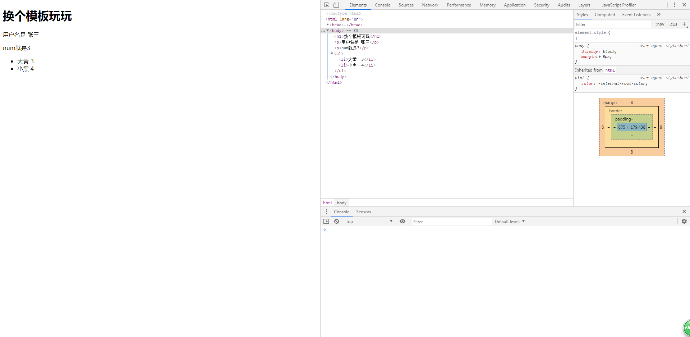

# Nunjucks模板引擎
> 知识大纲
* pug模板引擎利用缩进来体现html的子父级标签，感觉不是特别友好
* Nunjucks就和正常写的html是一样的赶脚，只是在里面加表达式，看上去相对友善
* [官方文档](https://nunjucks.bootcss.com/)

> 练习
* 简单使用
    1. 初始化项目，把koa相关的和模板引擎模块先安装了
        * 新建demo文件夹，进入该路径后`yarn init -y`
        * 安装对应的模块`yarn add koa koa-router koa-nunjucks-2 -S`
    2. 新建index.js，注入灵魂
        ```js
        const Koa = require("koa");
        const Router = require("koa-router");
        const nunjucks = require("koa-nunjucks-2");

        let app = new Koa();
        let router = new Router();
        app.use(nunjucks({
            ext: "html", //.njk 文件后缀，这里用的html
            path: __dirname + "views", //引擎所放在的目录
            nunjucksConfig: {
                trimBlocks: true, //防止xxs漏洞
            }
        }))
        router.get('/', ctx => {
            ctx.body = "hello nunjucks";
        })


        app.use(router.routes());
        app.listen(3000);    
        ``` 
    3. 新建view文件，新建index.html文件，随意写点内容，然后在index.js修改下，这个时候就能看到页面渲染出来了
        ```
        router.get('/', async ctx => {
            // ctx.body = "hello nunjucks";
            await ctx.render("index");
        })
        ```      
    4. 传点值进模板
        ```js
        router.get('/', async ctx => {
            // ctx.body = "hello nunjucks";
            await ctx.render("index", {
                username: "张三"
            });
        })
        ```
        ```html
        <!DOCTYPE html>
        <html lang="en">
        <head>
            <meta charset="UTF-8">
            <meta name="viewport" content="width=device-width, initial-scale=1.0">
            <meta http-equiv="X-UA-Compatible" content="ie=edge">
            <title>Document</title>
        </head>
        <body>
            <h1>换个模板玩玩</h1>
            <p>用户名是 {{username}}</p>
            {# 我是注释 #}
        </body>
        </html>    
        ```
    5. 判断和循环的语法
        ```js
        router.get('/', async ctx => {
            // ctx.body = "hello nunjucks";
            await ctx.render("index", {
                username: "张三",
                num: 3,
                arr: [
                    {
                        petName: "大黄",
                        age: 3
                    },
                    {
                        petName: "小黑",
                        age: 4
                    }
                ]
            });
        })
        ``` 
        ```html
        <!DOCTYPE html>
        <html lang="en">
        <head>
            <meta charset="UTF-8">
            <meta name="viewport" content="width=device-width, initial-scale=1.0">
            <meta http-equiv="X-UA-Compatible" content="ie=edge">
            <title>Document</title>
        </head>
        <body>
            <h1>换个模板玩玩</h1>
            <p>用户名是 {{username}}</p>
            {# 判断语句 #}
            
                <p>num是大于3的</p>
            
                <p>num是小于3的</p>
            
                <p>num就是3</p>
            
            {# 循环语句 #}
            <ul>
                
                <li>{{item.petName}}  {{item.age}}</li>
                
            </ul>
        </body>
        </html>    
        ``` 

        

    6. 过滤器(演示部分功能，详细的查看官方文档)
        * 我们在index模板中传入变量，hello world
            ```
            router.get('/', async ctx => {
                // ctx.body = "hello nunjucks";
                await ctx.render("index", {
                    username: "张三",
                    num: 3,
                    arr: [
                        {
                            petName: "大黄",
                            age: 3
                        },
                        {
                            petName: "小黑",
                            age: 4
                        }
                    ],
                    str: "hello world"
                });
            })        
            ```
        * 在页面中正常使用就是`{{str}}`
        * 这里我们使用下过滤器，比如把world替换成世界`{{str | replace("world", "世界")}}`  
        * 这边还可以连写，追加其他过滤方法，比如首字母大写`{{str | replace("world", "世界") | capitalize}}`        
 


* 模板
    1. 在views新建一个parent.html，注入灵魂,注意这里的block和endblock是固定的语法，left和right是自己定义的变量，需要和子类的对应起来
        ```html
        <div>
            <p>我是父级模板</p>
            
                左边内容
            
            
                右边内容
            
        </div>        
        ```  
    2. 我们建儿子继承父亲，新建一个son1.html
        ```html
        <!DOCTYPE html>
        <html lang="en">
        <head>
            <meta charset="UTF-8">
            <meta name="viewport" content="width=device-width, initial-scale=1.0">
            <meta http-equiv="X-UA-Compatible" content="ie=edge">
            <title>Document</title>
        </head>
        <body>
            
            
                我是son1里左边的内容
            
            
                我是son1里右边的内容
            
        </body>
        </html>        
        ``` 
    3. 添加son1的路由，打开后就是我们预期想要的渲染效果 
        ```js
        router.get("/son1", async ctx => {
            await ctx.render("son1");
        })        
        ```  
    4. 子可以拿到父的数据，分别来看下写法
        ```html
        <div>
            <p>我是父级模板</p>
            
                左边内容
            
            
                右边内容
            
            
                一些数据
            
        </div>
        ```
        ```html
            
            
                我是son1里左边的内容
            
            
                我是son1里右边的内容
            
            
                {{super()}}
            
        ```         
    5. 宏标签, 我们在index.html中玩下
        ```html
            
                <p>我的名字叫{{name}}, {{desc}}</p>
            

            {{introduce("gqf", "我是个天才")}}    
        ```
    6. nunjucks也有include的语法，和pug很类似，我们在views里新建一个footer.html 
        * 在footer.html中写入`<h1>我是公共底部</h1>`   
        * 在index.html中写入``

    7. 除了include还有import语法，import就是引入一些函数
        * 比如前面我们在index.html定义了一个宏标签，我们还可以多定义些其他的   
            ```html
                
                    <p>我的名字叫{{name}}, {{desc}}</p>
                
                
                    <p>我的工作是{{jobName}}, {{desc}}</p>
                
            ```   
        * 在views中新建个import.html,引入我们index.html中的函数  
            ```html
            <!DOCTYPE html>
            <html lang="en">
            <head>
                <meta charset="UTF-8">
                <meta name="viewport" content="width=device-width, initial-scale=1.0">
                <meta http-equiv="X-UA-Compatible" content="ie=edge">
                <title>Document</title>
            </head>
            <body>
                
                {{ obj.introduce("gqf", "是个天才") }}
                {{ obj.introduce("developer", "敲代码的咸鱼") }}
            </body>
            </html>
            ```
        * 路由添加这个页面，看下效果   

> 知道你不过瘾继续吧
* [目录](../../README.md)
* [上一篇-pug模板引擎](../day-11/pug模板引擎.md)
* [下一篇-如何验证用户名](../day-13/如何验证用户名.md)