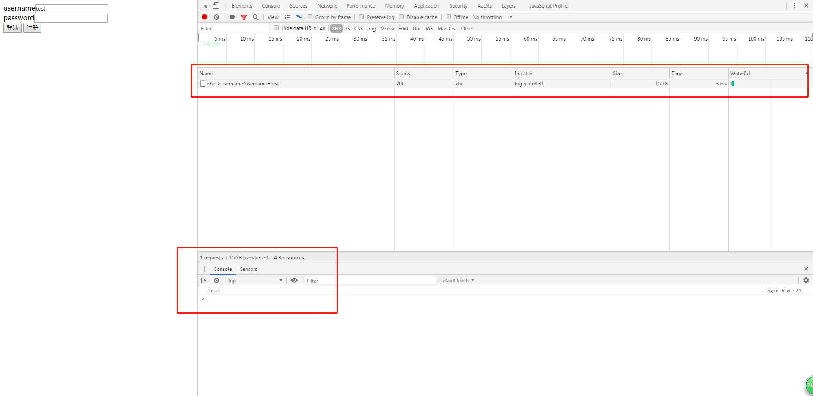
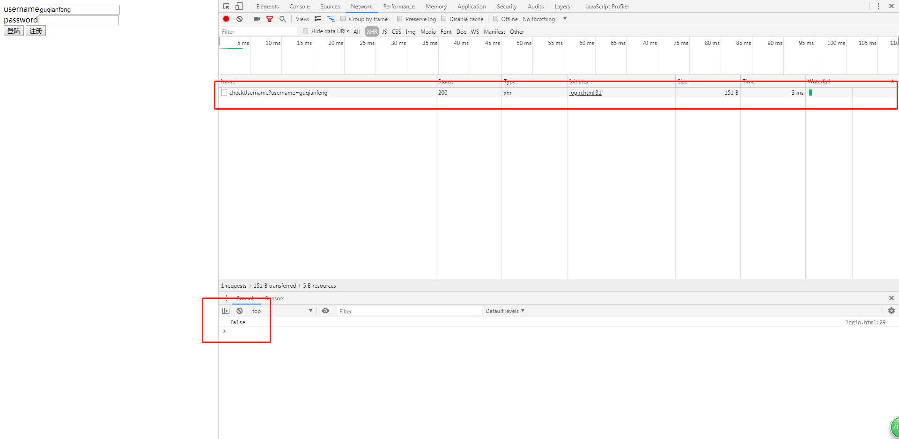
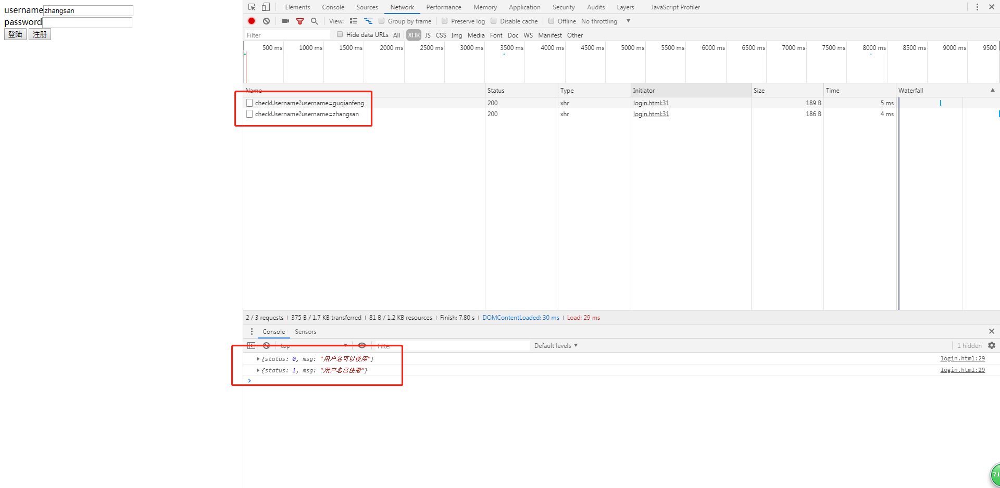

# 如何验证用户名

> 知识大纲
* 从本章开始，要开始弄前后端的交互了,先学习简单的ajax的使用
* ajax
    * 不刷新页面把数据提交到后台，然后在拿到后台返回的信息
    * 异步的javascript和xml
* 验证用户名的功能就是在输入用户名后，输入框失去焦点提示些信息
    * 该用户名可用
    * 该用户名已注册

> 练习
* 准备工作
    1. 先随意写一个登陆页面，在demo下新建一个static的目录，然后新建个login.html,这里偷懒就不写css了
        ```html
        <!DOCTYPE html>
        <html lang="en">
        <head>
            <meta charset="UTF-8">
            <meta name="viewport" content="width=device-width, initial-scale=1.0">
            <meta http-equiv="X-UA-Compatible" content="ie=edge">
            <title>Document</title>
        </head>
        <body>
            <div>
                <label for="username">username</label><input type="text" id="username" name="username">
            </div>
            <div>
                <label for="password">password</label><input type="password" id="password" name="password">
            </div>
            <div>
                <button>登陆</button>
                <button>注册</button>
            </div>
            
        </html>
        ```
    2. 在简单搭个后台，在demo下新建index.js，同样用koa来做
        ```js
        const Koa = require("koa");
        const Router = require("koa-router");
        const static = require("koa-static");

        let app = new Koa();
        let router = new Router();

        router.get("/", async ctx => {
        ctx.body = "hello Koa";
        })

        app.use(static(__dirname + "/static"));
        app.use(router.routes());

        app.listen(3000);
        ``` 
* 开撸(代码)  
    1. ajax前端实现     
        * 先要知道验证用户名，需要添加失去焦点的事件blur
        * 然后使用ajax的技术，XMLHttpRequest 
        * xhr.open中的三个参数，分别是请求方式，请求地址，是否异步 
        * xhr.onload
        * xhr.send
        * 具体代码如下
            ```js
            let usernameInput = document.querySelector("#username");
            usernameInput.addEventListener("blur", function(){
                //   console.log("失去焦点");
                let username = this.value;
                let xhr = new XMLHttpRequest();
                xhr.open("get", `/checkUsername?username=${username}`, true);
                xhr.onload = function(){
                    console.log(xhr.responseText); //这里拿到的就是后端返回的数据
                }
                xhr.send();
            }) 
            ```
    2. ajax后端实现
        * 配置router，写后端逻辑
            ```js
            router.get("/checkUsername", ctx => {
                let username = ctx.request.query.username;
                // console.log(username); 
                //这里其实是会去查数据库中有没有这个用户名，这里就简单模拟数据库只有一条guqianfeng的数据
                let flag = username !== "guqianfeng" ? true : false;
                ctx.body = flag;
            })
            ```
        * 这里的ctx.body返回的数据在前端xhr.responseText能拿到 
    3. 可以简单玩下，看下效果，我们分别输入test失去焦点和guqianfeng失去焦点看下效果

          

         

    4. 后续有机会在演示连接mysql或者mongodb，这里感觉还是太low了，用一个文件来模拟数据
        * 在demo下新建一个data的目录
        * 在data的目录下新建users.json
            ```json
            [
                {
                    "id": 1,
                    "username": "zhangsan",
                    "password": 123
                },
                {
                    "id": 2,
                    "username": "lisi",
                    "password": 456
                }
            ]
            ```    
    5. 在index.js中引入这个数据文件`const userData = require("./data/users.json");`
    6. 这样我们就可以去查找有没有用户了，后端逻辑修改  
        ```js
        router.get("/checkUsername", ctx => {
            let username = ctx.request.query.username;
            // console.log(username); 
            let index = userData.findIndex(item => item.username === username);
            if(index > -1){
                ctx.body = {
                    status: 1,
                    msg: "用户名已注册"
                }
            }else{
                ctx.body = {
                    status: 0,
                    msg: "用户名可以使用"
                }
            }
        })
        ``` 
    7. 注意这边后端返回的是json字符串(koa已经帮忙JSON.stringify了)，前端可以`console.log(JSON.parse(xhr.responseText));`
    8. 然后可以继续玩耍下  

         

    9. 然后前端其实就可以用这个msg去做提示了 
        ```js
        let usernameInput = document.querySelector("#username");
        let infoSpan = document.querySelector("#info");
        usernameInput.addEventListener("blur", function(){
        //   console.log("失去焦点");
        let username = this.value;
        let xhr = new XMLHttpRequest();
        xhr.open("get", `/checkUsername?username=${username}`, true);
        xhr.onload = function(){
            let res = JSON.parse(xhr.responseText);
            // console.log(res, res.status);
            infoSpan.innerHTML = res.msg;
            infoSpan.style.color = ["green", "red"][res.status];
        }
        xhr.send();        
        ```

> 知道你不过瘾继续吧
* [目录](../../README.md)
* [上一篇-Nunjucks模板引擎](../day-12/Nunjucks模板引擎.md)
* [下一篇-ajax的请求方式](../day-14/ajax的请求方式.md)