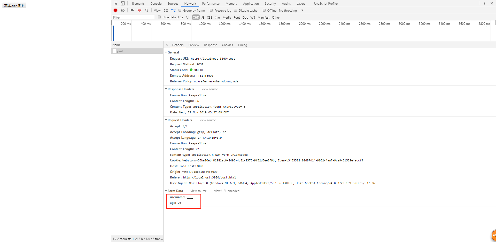
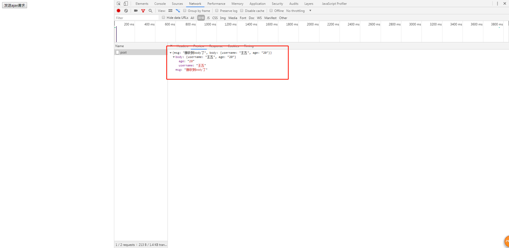
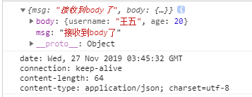

# ajax的请求方式

> 知识大纲
* 上一章我们使用ajax对用户名进行了验证
* 这章主要学习get和post请求
    1. get - 通过url传参
    2. post - 传body
* 根据restful，其实还有put，delete请求，这个其实和上面2者差不多的
* crud - 增删改查
    1. c - create - 增
    2. r - read - 查
    3. u - update - 改
    4. d - delete - 删
* 主要区别是
    1. get - 查
    2. post - 增
    3. put - 改
    4. delete - 删

> 练习    
1. 我们依然使用上次的demo项目
2. 我们在上一章验证用户名使用过get请求了，这次我们换一种url的格式，同样也用get请求模拟
3. 我们先写前端，在static里新建一个get.html
    ```html
    <!DOCTYPE html>
    <html lang="en">
    <head>
        <meta charset="UTF-8">
        <meta name="viewport" content="width=device-width, initial-scale=1.0">
        <meta http-equiv="X-UA-Compatible" content="ie=edge">
        <title>Document</title>
    </head>
    <body>
        <button>发送ajax请求</button>
        <script>
            {
                let button = document.querySelector("button");
                button.addEventListener("click", e => {
                    let xhr = new XMLHttpRequest();
                    xhr.open("get", "/get/3", true);
                    xhr.onload = function(){
                        console.log(JSON.parse(xhr.responseText));
                    };
                    xhr.send();
                })
            }
        </script>
    </body>
    </html>
    ```
4. 然后在写后端，在index.js添加/get的请求
    ```js
    router.get("/get/:id", ctx => {
        console.log(ctx.params.id);
        ctx.body = {
            id: ctx.params.id
        }
    })
    ```
5. url中query通常就是`/xxx?a=1&b=2&c=3.......`,如果是param就是`/xxx/{id}/.....`
6. 在后端获取的方式也不一样，前者是通过`ctx.request.query.xxx`,后者就通过`ctx.params.xxx`   
7. 现在在来玩下post请求,我们在static下在新建个post.html 
    1. 一般post不会再url后面通过query去传
    2. 它主要是组装一个body传入后端
    3. 需要设置编码格式
    4. 具体代码如下
        ```js
        let button = document.querySelector("button");
        button.addEventListener("click", e => {
            let xhr = new XMLHttpRequest();
            xhr.open("post", "/post", true);
            xhr.onload = function(){
                console.log(JSON.parse(xhr.responseText));
            };
            xhr.setRequestHeader("content-type", "application/x-www-form-urlencoded"); // 默认的编码格式
            let data = "username=王五&age=20";
            xhr.send(data);
        })
        ```
8. 后端添加代码
    1. 先要引入koa-body依赖,`const koaBody = require("koa-body");`
    2. 记得要use,`app.use(koaBody());`,注意中间件有先后顺序，要放在`app.use(router.routes());`前面
    3. 然后添加post请求的路由
        ```js
        router.post("/post", ctx => {
            console.log(ctx.request.body);
            ctx.body = {
                msg: "接收到body了",
                body: ctx.request.body
            }
        })
        ``` 
9. 然后点击按钮就能看到效果啦 

    

    

10. 上传文件以后会在说，现在简单提一句，就是要把xhr.setRequestHeader的Content-Type(这里的大小写不敏感，大写也可以),设置成二进制编码

11. 这里说个常用的Content-Type,那就是application/json,所以传的body数据格式也要改
    ```js
        let button = document.querySelector("button");
        button.addEventListener("click", e => {
            let xhr = new XMLHttpRequest();
            xhr.open("post", "/post", true);
            xhr.onload = function(){
                console.log(JSON.parse(xhr.responseText));
            };
            // xhr.setRequestHeader("content-type", "application/x-www-form-urlencoded"); // 默认的编码格式
            // let data = "username=王五&age=20";
            xhr.setRequestHeader("Content-Type", "application/json");
            let data = JSON.stringify({
                username: "王五",
                age: 20,
            })
            xhr.send(data);
        })
    ```
12. 前面设置了请求头,所以在前端拿到后端给的数据的时候，肯定还有响应头
    * getAllResponseHeaders - 拿到所有的响应头
    * 我们在post.html里写上具体代码看下
        ```js
        xhr.onload = function(){
            console.log(JSON.parse(xhr.responseText));
            console.log(xhr.getAllResponseHeaders());  
        };
        ```
    * 页面截图效果如下  

        
          
    * 也可以指定获取响应头的某个key,比如`console.log(xhr.getResponseHeader("Content-Type"));`      

> 知道你不过瘾继续吧
* [目录](../../README.md)
* [上一篇-如何验证用户名](../day-13/如何验证用户名.md)
* [下一篇-同步及异步ajax](../day-15/同步及异步ajax.md)