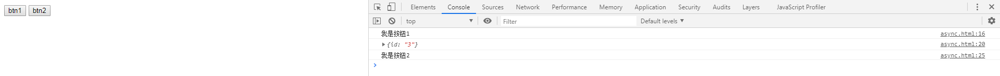

# 同步及异步ajax

> 知识大纲
* 上一章我们主要说了ajax的请求方式,并且实现了简单的前后端交互
* 这一章我们主要来说下`xhr.open`的第三个参数,要不要异步执行操作
    * true - 异步(默认值为ture,即默认为异步)
    * false - 同步
* xhr.onload去接收后端的数据这个就是一个完整的ajax
* 了解下onreadystatechange,这是以前比较老的方式,现在主要使用的还是onload
    * xhr.readyState == 4 && xhr.status === 200
    * 当上述条件为真时,在打印下xhr.responseText
    * 上述写法等同于onload
    * 我们在onload的时候也可以打印下上述的两个条件
        ```js
        xhr.onload = function(){
            console.log(JSON.parse(xhr.responseText));
            console.log(xhr.readyState);
            console.log(xhr.status);
        };    
        ```      

> 练习
* 我们依然使用上次的那个demo,在static里新写一个async.html
    ```html
    <!DOCTYPE html>
    <html lang="en">
    <head>
        <meta charset="UTF-8">
        <meta name="viewport" content="width=device-width, initial-scale=1.0">
        <meta http-equiv="X-UA-Compatible" content="ie=edge">
        <title>Document</title>
    </head>
    <body>
        <button>btn1</button>
        <button>btn2</button>
        <script>
            {
                let aBtn = document.querySelectorAll("button");
                aBtn[0].addEventListener("click", e => {
                    console.log("我是按钮1");
                    let xhr = new XMLHttpRequest();
                    xhr.open("get", "/get/3", true);
                    xhr.onload = function(){
                        console.log(JSON.parse(xhr.responseText));
                    };
                    xhr.send(); 
                });
                aBtn[1].addEventListener("click", e => {
                    console.log("我是按钮2"); 
                });
            }
        </script>
    </body>
    </html>
    ```
* 这里我们第一个按钮调用ajax,open的第三个参数传的是true也就是异步,第二个按钮就是点击下打印一句话
* 然后操作一把，点击按钮1然后在点击按钮2

    

* 为了演示异步我们这边要调整下network 
    1. f12后进入Network, 然后能看到Offline边上的No throttling
    2. 选择slow 3G
    3. 具体操作如下
        
        

* 然后我们在操作一把,明显从后端接受数据慢了，而且我们依然可以点击按钮1后再点击按钮2

    

* 现在我们把前端改成同步请求，并且使用slow3g   
* 然后发现，页面就卡主了，按钮2点击不了，我这边使用的是百分浏览器，按钮2点不动的感觉，然后当后端数据返回后，才陆续打印了"我是按钮2"
* 所以同步你就做不了其他事情了，在后端返回数据后才能操作~主要还是看业务需求 


> 知道你不过瘾继续吧
* [目录](../../README.md)
* [上一篇-ajax的请求方式](../day-14/ajax的请求方式.md)
* [下一篇-xml数据返回](../../Day16-30/day-16/xml数据返回.md)