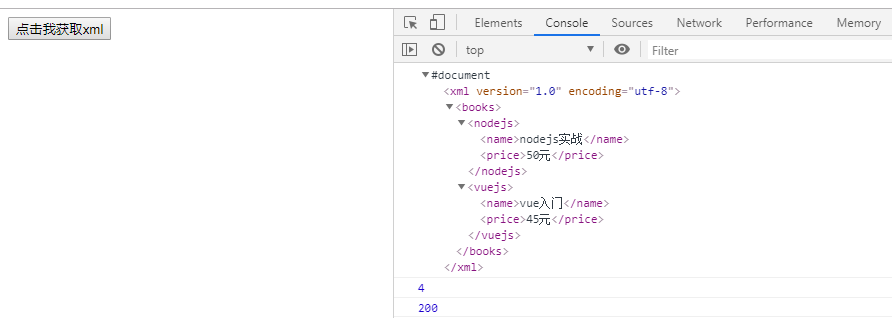

# xml数据返回

> 知识大纲
* 之前有说ajax(async javascript and xml)是异步的javascript和xml
* 在我们之前的案例中使用的都是
    ```
    ctx.body = {
        status: 1,
        msg: "用户名已注册"
    }
    ```
    ```
    console.log(JSON.parse(xhr.responseText));
    ```
* ctx.body自动返回个json给前端，前端在通过JSON.parse(xhr.responseText)拿到对应的数据
* 这章我们主要看下怎么直接让xml数据返回   

> 练习
1. 还是之前的项目,在static里新建一个xml.html，注意细节，我们请求url改为了/xml,以及拿后端的数据使用的是xhr.responseXML
    ```html
    <!DOCTYPE html>
    <html lang="en">
    <head>
        <meta charset="UTF-8">
        <meta name="viewport" content="width=device-width, initial-scale=1.0">
        <meta http-equiv="X-UA-Compatible" content="ie=edge">
        <title>Document</title>
    </head>
    <body>
        <button>点击我获取xml</button>
        <script>
            {
                let btn = document.querySelector("button");
                btn.addEventListener("click", e => {
                    let xhr = new XMLHttpRequest();
                    xhr.open("get", "/xml", true);
                    xhr.onload = function(){
                        console.log(xhr.responseXML);
                        console.log(xhr.readyState);
                        console.log(xhr.status);
                    };
                    xhr.send(); 
                });
            }
        </script>
    </body>
    </html>
    ```
2. 写后端的逻辑，记住要设置contentType为xml，否则前端取不到
    ```js
    router.get("/xml", ctx => {
        ctx.set("content-type", "text/xml");
        ctx.body = `<xml version='1.0' encoding='utf-8'>
                            <books>
                                <nodejs>
                                    <name>nodejs实战</name>
                                    <price>50元</price>
                                </nodejs>
                                <vuejs>
                                    <name>vue入门</name>
                                    <price>45元</price>
                                </vuejs>
                            </books>
                        </xml>`;
    });
    ```  
3. 这个时候就可以去玩耍了

    
    
4. 我们前端依然可以通过各种方式去获取标签元素,比如`console.log(xhr.responseXML.getElementsByTagName("name"));`,这个就获取到了前面我们写的xml中的2个name的节点

5. 其实和js操作dom的方法是一样的

6. 如果后端忘记设置contentType是xml了,前端直接取不到,但前端也可以通过另外个方式去获取`xhr.overrideMimeType("text/xml");`

> 知道你不过瘾继续吧
* [目录](../../README.md)
* [上一篇-同步及异步ajax](../../Day01-15/day-15/同步及异步ajax.md)