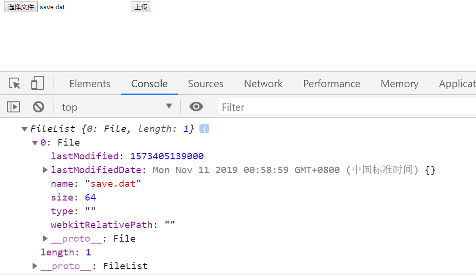
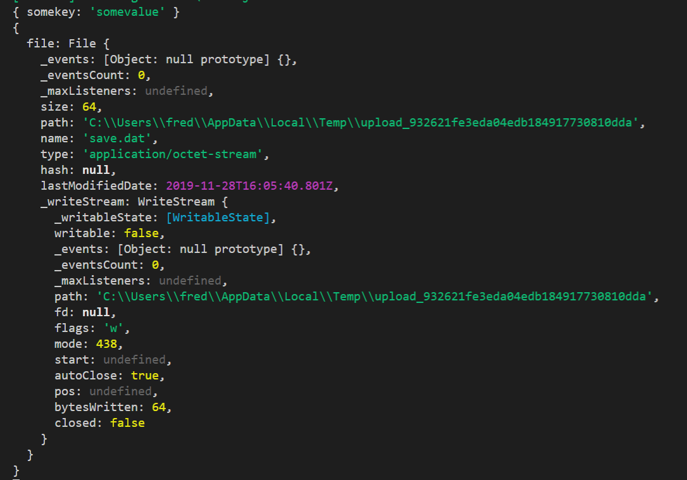

# FormData实现文件上传

> 知识大纲
* 使用FormData实现下文件上传
* 上传不能通过get请求上传
* `input[type=file]`要设置可以上传多个文件的属性才能选择多个文件上传
* FormData会帮我们设置好ContentType

> 练习
1. 依然使用之前的项目，在static中新建formdata.html,这里先看下单文件的上传
    ```html
    <!DOCTYPE html>
    <html lang="en">
    <head>
        <meta charset="UTF-8">
        <meta name="viewport" content="width=device-width, initial-scale=1.0">
        <meta http-equiv="X-UA-Compatible" content="ie=edge">
        <title>Document</title>
    </head>
    <body>
        <input type="file" class="myfile">
        <button>上传</button>
        <script>
            {
                let oBtn = document.querySelector("button");
                let oInput = document.querySelector(".myfile");

                oBtn.addEventListener("click", e => {
                    console.log(oInput.files);
                })
            }
        </script>
    </body>
    </html>
    ```
2. 随便选个文件操作一把先看下,可以发现files能拿到我们的文件列表  

    

3. 然后我们取第0个就能拿到想要的单个文件了
4. 通过实例化个formData,然后用formData取组装数据
5. 最后通过ajax传到后台，具体代码如下
    ```js
    oBtn.addEventListener("click", e => {
        // console.log(oInput.files);
        let file = oInput.files[0];
        let formData = new FormData();
        formData.append("file", file);
        formData.append("somekey", "somevalue");
        let xhr = new XMLHttpRequest();
        xhr.open("post", "/upload", true);
        xhr.onload = function(){
            console.log(JSON.parse(xhr.responseText));
        }
        xhr.send(formData);
    })    
    ```
6. 开始写后端代码，进入index.js
7. 先要给我们的koa-body设置个参数，否则接受不了上传的文件  
    ```js
    app.use(koaBody({
        multipart: true
    }));
    ```
8. 然后在写我们的upload
    ```js
    router.post("/upload", ctx => {
        console.log(ctx.request.body);
        console.log(ctx.request.files);
        ctx.body = {
            status: 1,
            msg: "上传成功"
        }
    })
    ```    
9. 操作吧观察下我们后端控制台打印的信息

    

10. 注意看`ctx.request.files`,其中有个属性file其实是我们前端设置的key,我们可以通过`ctx.request.files.file`就能拿到这个文件了,现在要做的就是把这个文件做个存储,所以要引用fs模块,然后把它写到static文件夹下,可以在static下新建一个upload文件夹,专门用来放上传的文件 
    ```js
    router.post("/upload", ctx => {
        // console.log(ctx.request.body);
        // console.log(ctx.request.files);
        let fileData = fs.readFileSync(ctx.request.files.file.path);
        let writePath = __dirname + "/static/upload/" + ctx.request.files.file.name
        // console.log(writePath);
        fs.writeFileSync(writePath, fileData);
        ctx.body = {
            status: 1,
            msg: "上传成功"
        }
    })
    ```
11. 然后就可以上传一把试试了，就能惊喜地发现文件上传成功,upload里有我们上传成功的文件

> 知道你不过瘾继续吧
* [目录](../../README.md)
* [上一篇-xml数据返回](../day-16/xml数据返回.md)
* [下一篇-上传文件事件钩子](../day-18/上传文件事件钩子.md)