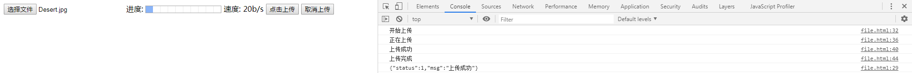
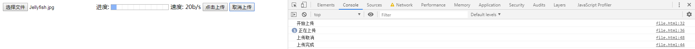

# 上传文件事件钩子

> 知识大纲
* 监控上传的进度和速度
* upload事件
    * onloadstart - 上传开始
    * onprogress - 数据传输进行中
        * evt.total - 需要传输的总大小
        * evt.loaded - 当前传输文件的大小
    * onabort - 上传操作终止
    * onerror - 上传失败
    * onload - 上传成功
    * onloadend - 上传完成(不论成功与否)

> 练习
1. 继续在之前的项目操作,static下新建一个file.html,用的依然是之前的后端上传接口,然后测试下上传文件的时间钩子
    ```html
    <!DOCTYPE html>
    <html lang="en">
    <head>
        <meta charset="UTF-8">
        <meta name="viewport" content="width=device-width, initial-scale=1.0">
        <meta http-equiv="X-UA-Compatible" content="ie=edge">
        <title>Document</title>
    </head>
    <body>
        <input type="file" class="myfile">
        进度: <progress value="10" max="100"></progress> <!-- 进度条value当前进度max最大值 -->
        速度: <span class="speed">20b/s</span> <!-- 先静态页面布局，写死个假数据 -->
        <button>点击上传</button>
        <button>取消上传</button>
        <script>
            {
                let xhr = new XMLHttpRequest(); //因为要取消上传，所以放在最外面

                let aBtn = document.querySelectorAll("button");
                let oInput = document.querySelector("input.myfile");
                //上传
                aBtn[0].addEventListener("click", function(){
                    let file = oInput.files[0];
                    // console.log(file);
                    let formData = new FormData();
                    formData.append("file", file); //这里的key必须是file,请看下我们的后端代码就知道了
                    xhr.open("post", "/upload", true);
                    xhr.onload = function(){
                        console.log(xhr.responseText);
                    } 
                    xhr.upload.addEventListener("loadstart", function(){
                        console.log("开始上传");
                        
                    })
                    xhr.upload.addEventListener("progress", function(){
                        console.log("正在上传");
                        
                    })
                    xhr.upload.addEventListener("load", function(){
                        console.log("上传成功");
                        
                    })
                    xhr.upload.addEventListener("loadend", function(){
                        console.log("上传完成");
                        
                    })
                    xhr.send(formData);
                })
                //取消上传
                aBtn[1].addEventListener("click", function(){
                    
                })
            }
        </script>
    </body>
    </html>
    ```
2. 上传一把看看，就能看到 

    

3. 取消上传，我们接着在我们的html中给第二个按钮添加点击事件的逻辑，还有记得要添加取消上传的事件钩子
    ```js
    //取消上传
    aBtn[1].addEventListener("click", function(){
        xhr.abort();
    })
    ```
    ```js
    xhr.upload.addEventListener("abort", function(){
        console.log("上传取消");
        
    })
    ```
4. 由于上传速度比较快,这边需要在network中改为slow3g,测试的方法就是改好后点击上传后立刻点击取消上传看下效果  

    

> 知道你不过瘾继续吧
* [目录](../../README.md)
* [上一篇-FormData实现文件上传](../day-17/FormData实现文件上传.md)    
* [上一篇-上传进度及速度](../day-19/上传进度及速度.md)    
