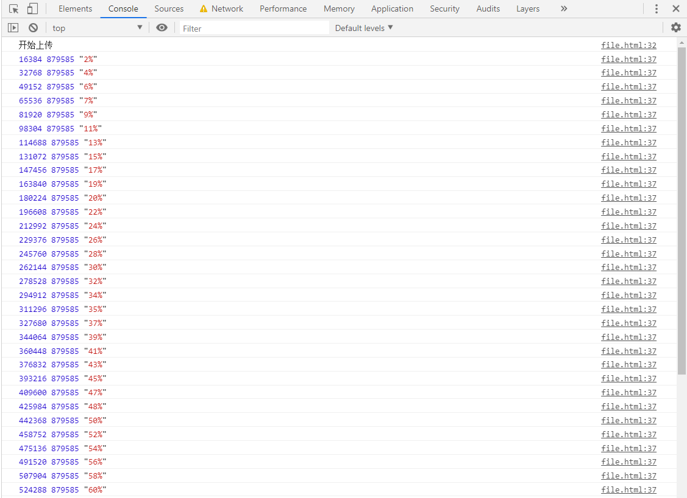
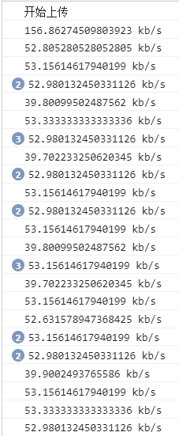
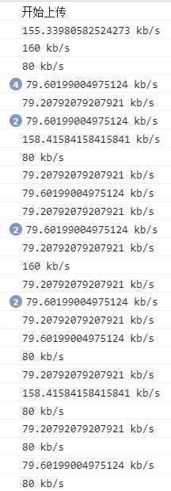
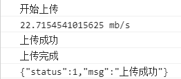

# 上传进度及速度
> 知识大纲
* 上一章简单了解了下上传文件的事件钩子
* 本章将完善上一章的案例
    * 算进度肯定在onprogress(正在上传)里操作
    * 注意参数事件对象有这么2个属性(total, loaded)
    * 为了演示效果我们要用到slow3g,即调整开发者工具中的network,否则上传太快,会看不出明显的效果

> 练习
1. 在上次的事件钩子(progress)里添加逻辑
    ```js
    xhr.upload.addEventListener("progress", function(e){
        // console.log("正在上传");
        console.log(e.loaded, e.total, (e.loaded / e.total * 100).toFixed(0) + "%");
    })
    ```
2. 页面操作一把 

    

    

3. 然后就是很简单的操作页面元素了,记得先把progress元素的默认value值先改为0,后续也可以在加个span显示进度条百分比,这里的功能小伙伴自行实现
    ```js
    xhr.upload.addEventListener("progress", function(e){
        // console.log("正在上传");
        // console.log(e.loaded, e.total, (e.loaded / e.total * 100).toFixed(0) + "%");
        let percent = (e.loaded / e.total * 100).toFixed(0);
        document.querySelector("progress").value = percent;
    })
    ```
4. 然后操作一把效果就出来了,完美~接下去就是处理上传速度的问题 
5. 上传速度的算法其实很简单,我们可以声明全局变量startTime和currentSize,用来表示开始的时间和当前上传的文件大小,然后每次通过时间差再去计算
    * startTime在loadstart的时候可以用`new Date().getTime()`去赋值
    * currentSize在loadstart的时候,即开始的时候是0,所以`currentSize = 0`
    * 在progress的时候`let endTime = new Date().getTime();`,然后就可以计算出与startTime的时间差,注意算出来的时间差单位是毫秒所以除上1000后才是s 
    * 同时在progress的时候可以记录当前上传的文件大小的差值`let disSize = e.loaded - currentSize;`
    * 然后就能计算速度了`let speed = disSize / disTime;`
        * 上传单位可以处理下
        * 计算出来的速度时b/s
        * 有时候速度很快的时候我们可以转换下单位，就是转换b/s=>kb/s=>mb/s=>gb/s
    * 最后在progress里不要忘记还要把startTime重新用`new Date().getTime()`去赋值 
    * 同理，currentSize也需要处理下`currentSize = e.loaded;`
    * 最终代码如下
        ```js
        xhr.upload.addEventListener("progress", function(e){
            let endTime = new Date().getTime();
            let disTime = (endTime - startTime) / 1000;
            let disSize = e.loaded - currentSize;
            let speed = disSize / disTime; 
            let unit = "b/s";
            if(speed / 1024 > 1){
                speed = speed / 1024; 
                unit = "kb/s";
            }
            if(speed / 1024 > 1){
                speed = speed / 1024;
                unit = "mb/s";
            }
            if(speed / 1024 > 1){
                speed = speed / 1024;
                unit = "gb/s";
            }
            console.log(speed + " " + unit); 
            startTime = new Date().getTime();
            currentSize = e.loaded;
            // console.log("正在上传");
            // console.log(e.loaded, e.total, (e.loaded / e.total * 100).toFixed(0) + "%");
            let percent = (e.loaded / e.total * 100).toFixed(0);
            document.querySelector("progress").value = percent;
        })
        ```
6. 分别演示slow3g,fast3g,No throttling 
    * slow3g

        

    * fast3g

        

    * No throttling  

         

7. 然后就是动态改变页面中显示上传速度的地方就可以了
    ```js
    let showSpeed = speed.toFixed(2) + " " + unit;
    document.querySelector(".speed").innerHTML = showSpeed;
    ```

8. 这样文件上传进度速度计算就完成了

> 知道你不过瘾继续吧
* [目录](../../README.md)
* [上一篇-上传文件事件钩子](../day-18/上传文件事件钩子.md) 