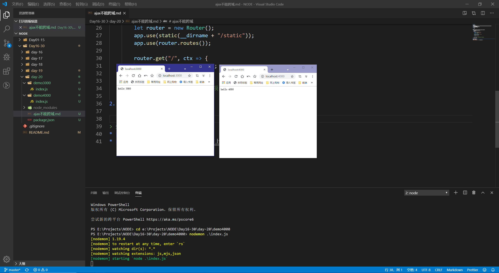
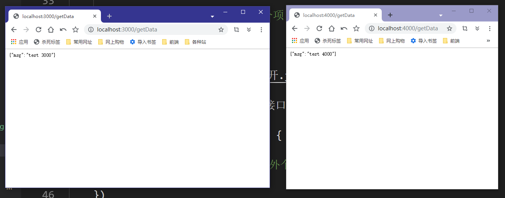
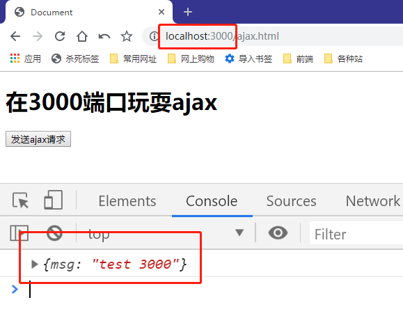
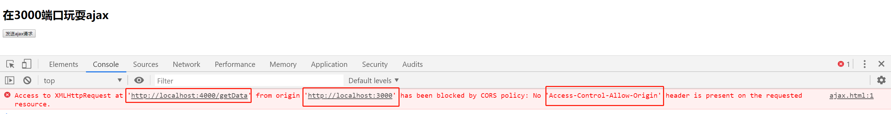
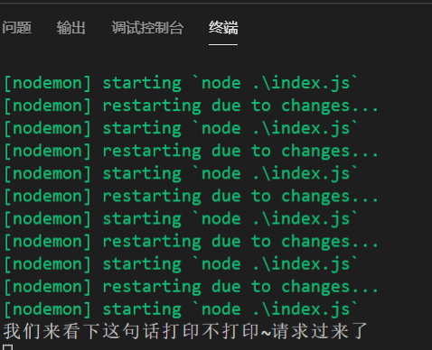

# ajax不能跨域

> 知识大纲
* 浏览器同源策略
    * 同源策略是浏览器的一个安全功能,不同源的客户端脚本在没有明确授权的情况下，不能读写对方的资源
    * 源:协议,域名和端口
* 协议,域名,端口不一致会造成跨域问题

> 练习
1. 新建2个项目,老样子用koa搭建下,分别监听2个端口号,这样就能跨域
    * 2个项目分别叫demo3000,demo4000
    * yarn init -y
    * yarn add koa koa-router koa-static -S
    * 创建index.js
        ```js
        const Koa = require("koa")
        const Router = require("koa-router")
        const static = require("koa-static")

        let app = new Koa();
        let router = new Router();
        app.use(static(__dirname + "/static"));
        app.use(router.routes());

        router.get("/", ctx => {
            ctx.body = "hello Koa";
        })

        app.listen(3000); //另外个项目监听4000,其他代码一致
        ```
2. 2个本地服务器一起开启    

     

3. 我们在2个index.js中写一个同样的接口 
    ```js
    router.get("/getData", ctx => {
        ctx.body = {
            msg: "test 3000" //另外个写4000
        }
    })
    ```
4. 所以我们访问下接口可以看到  

    

5. 我们在demo3000下先来玩个同源的ajax吧,在demo3000下新建个static,然后新建ajax.html  
    ```html
    <!DOCTYPE html>
    <html lang="en">
    <head>
        <meta charset="UTF-8">
        <meta name="viewport" content="width=device-width, initial-scale=1.0">
        <meta http-equiv="X-UA-Compatible" content="ie=edge">
        <title>Document</title>
    </head>
    <body>
        <h1>在3000端口玩耍ajax</h1>
        <button>发送ajax请求</button>
        <script>
            {
                let oBtn = document.querySelector("button");
                oBtn.addEventListener("click", e => {
                    let xhr = new XMLHttpRequest();
                    xhr.open("get", "/getData", true);
                    xhr.onload = function(){
                        console.log(JSON.parse(xhr.responseText));
                    }
                    xhr.send();
                })
            }
        </script>
    </body>
    </html>
    ```
6. 同源下,直接/getData访问的就是3000的这个项目下的接口，没有任何问题

    

7. 那跨域的玩法怎么搞，其实很简单，只要改下url就可以了 
    ```js
    let oBtn = document.querySelector("button");
    oBtn.addEventListener("click", e => {
        let xhr = new XMLHttpRequest();
        // xhr.open("get", "/getData", true); //同源
        xhr.open("get", "http://localhost:4000/getData", true); //跨域
        xhr.onload = function(){
            console.log(JSON.parse(xhr.responseText));
        }
        xhr.send();
    })
    ```
8. 注意这里跨域是因为端口号不一致，我们的协议http是一样的,域名也是一样的localhost
9. 然后点击按钮就可以看到跨域问题

    

10. 我们可以考虑下问题是不是，跨域是不是服务器之间真的没有通，为了验证这个问题，我们可以在4000端口这里的接口打印一句话试试
    * 在demo4000的index.js加上这句代码
        ```js
        router.get("/getData", ctx => {
            console.log("我们来看下这句话打印不打印~请求过来了");
            ctx.body = {
                msg: "test 4000"
            }
        })
        ```
    * 然后我们在点击下发送ajax请求看下，可以发现虽然页面报了跨域的错，但是我们的日志展示的是

            

11. 后面的章节我们会学习怎么解决跨域                
    
> 知道你不过瘾继续吧
* [目录](../../README.md)
* [上一篇-上传进度及速度](../day-19/上传进度及速度.md) 
* [下一篇-jsonp原理](../day-21/jsonp原理.md) 