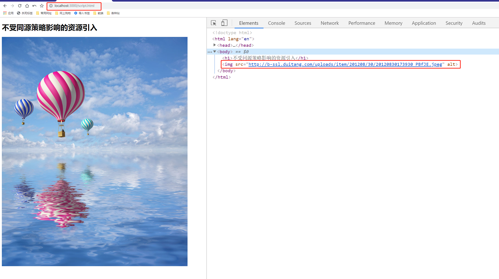
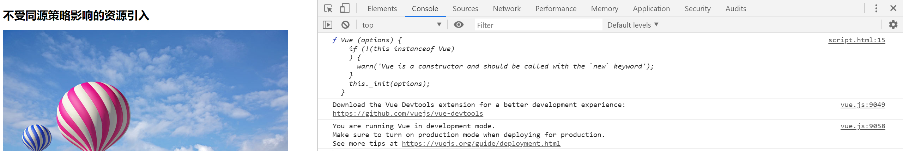
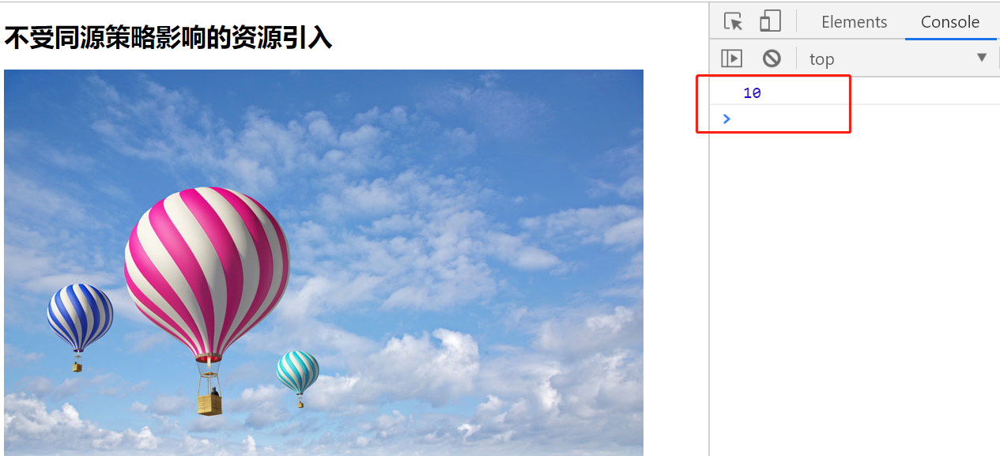
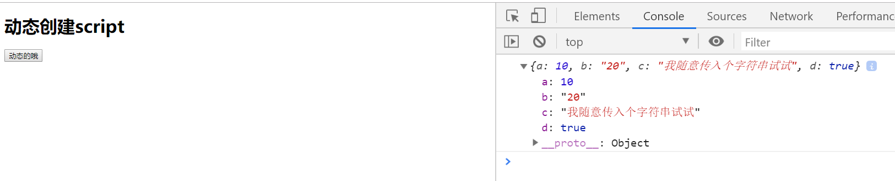
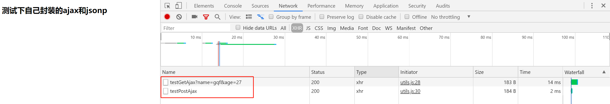
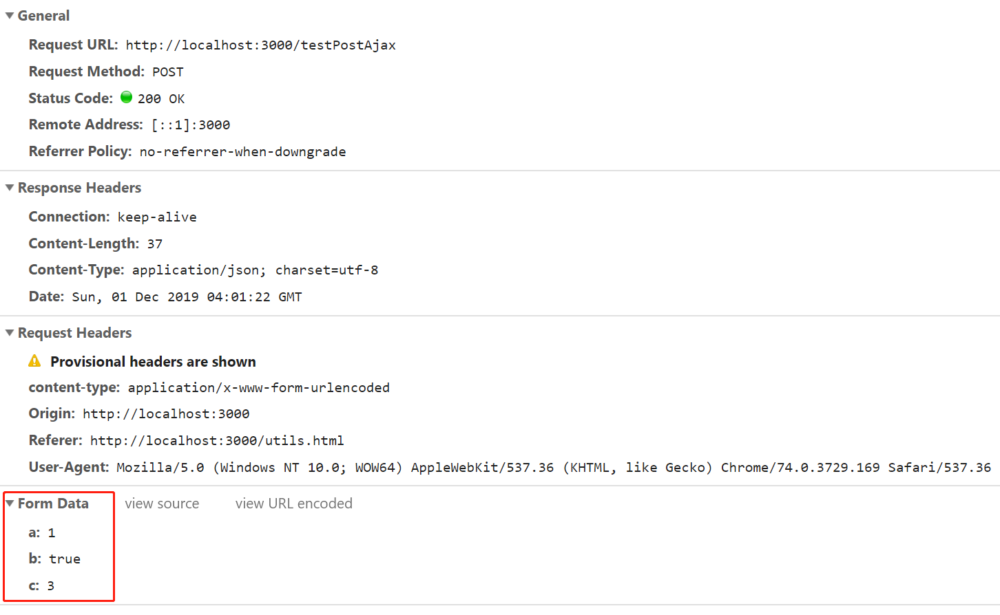
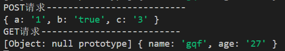
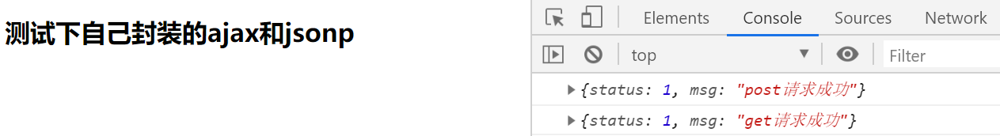
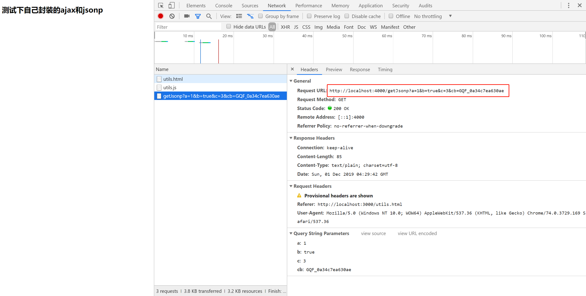
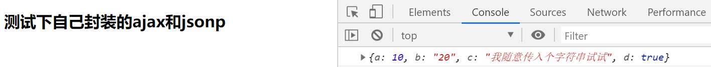

# jsonp原理

> 知识大纲
* jsonp是解决跨域的一种方式
* 不受同源策略影响的资源引入
    1. script
    2. img
    3. link
    4. iframe

> 练习 
1. 还是之前的项目，我们在3000的项目下新建一个页面，取名叫script.html
2. 不受同源策略影响的资源引入，其实很简单,我们百度随便搞个图片下来 
    ```html
    <!DOCTYPE html>
    <html lang="en">
    <head>
        <meta charset="UTF-8">
        <meta name="viewport" content="width=device-width, initial-scale=1.0">
        <meta http-equiv="X-UA-Compatible" content="ie=edge">
        <title>Document</title>
    </head>
    <body>
        <h1>不受同源策略影响的资源引入</h1>
        
    </body>
    </html>    
    ``` 
3. 很明显，我们引入的图片协议相同，域名不同，端口也不同，根据定义属于跨域，但img是属于不受同源策略影响的资源引入，所以依然能够展示这个图片

    

4. script标签也是这样，我们也可以简单测试下，复制下vue官网的script标签，引入vue    
    ```html
    <!DOCTYPE html>
    <html lang="en">
    <head>
        <meta charset="UTF-8">
        <meta name="viewport" content="width=device-width, initial-scale=1.0">
        <meta http-equiv="X-UA-Compatible" content="ie=edge">
        <title>Document</title>
        <script src="https://cdn.jsdelivr.net/npm/vue/dist/vue.js"></script>
    </head>
    <body>
        <h1>不受同源策略影响的资源引入</h1>
        
        <script>
            {
                console.log(Vue);
            }
        </script>
    </body>
    </html>    
    ```
5. 然后打开页面看下

    

6. 既然知道原理了那我们就可以这么操作下了
    1. 先在4000端口的项目中，新写个接口 
        ```js
        router.get("/getJsonp", ctx => {
            ctx.body = "let a = 10;"
        })    
        ```
    2. 然后在3000端口的项目中的script.html的页面中引入 
        ```html
        <!DOCTYPE html>
        <html lang="en">
        <head>
            <meta charset="UTF-8">
            <meta name="viewport" content="width=device-width, initial-scale=1.0">
            <meta http-equiv="X-UA-Compatible" content="ie=edge">
            <title>Document</title>
            <!-- <script src="https://cdn.jsdelivr.net/npm/vue/dist/vue.js"></script> -->
            <script src="http://localhost:4000/getJsonp"></script>
        </head>
        <body>
            <h1>不受同源策略影响的资源引入</h1>
            
            <script>
                {
                    // console.log(Vue);
                    console.log(a);
                }
            </script>
        </body>
        </html>        
        ```    
    3. 可以看到我们引入的script标签的写法是`<script src="http://localhost:4000/getJsonp"></script>`
    4. 然后我们在自己写的js中打印了a,来看下结果吧  

          

    5. 以上代码就是最简单的一个jsonp的实现   
    6. 但这样的实现并不是很好，我们可以动态创建script实现请求
    7. 我们在重新新开个页面，在3000的项目中的static下新建个jsonp.html
        ```html
        <!DOCTYPE html>
        <html lang="en">
        <head>
            <meta charset="UTF-8">
            <meta name="viewport" content="width=device-width, initial-scale=1.0">
            <meta http-equiv="X-UA-Compatible" content="ie=edge">
            <title>Document</title>
        </head>
        <body>
            <h1>动态创建script</h1>
            <button>动态的哦</button>
            <script>
                {
                    let oBtn = document.querySelector("button");
                    oBtn.addEventListener("click", e => {
                        let scriptEle = document.createElement("script");
                        scriptEle.src = "http://localhost:4000/getJsonp";
                        document.querySelector("head").appendChild(scriptEle);
                        //console.log(a) //这个会报错,因为还没有加载好scirpt标签
                        scriptEle.onload = function(){
                            //注意这里一定要onload否则取不到a，因为是异步的
                            console.log(a);
                        }
                    },{once: true})
                }
            </script>
        </body>
        </html>
        ```
    8. 虽然前端页面依然能拿到我们的值，但这样的写法并不好，一般我们会传入一个回调函数，然后由后端在处理好返回给我们，代码如下 
        1. 先来看下3000里的页面该怎么写
            ```js
            function cbfn(res){
                console.log(res);
            }

            let oBtn = document.querySelector("button");
            oBtn.addEventListener("click", e => {
                let scriptEle = document.createElement("script");
                scriptEle.src = "http://localhost:4000/getJsonp?cb=cbfn";
                document.querySelector("head").appendChild(scriptEle);
                //console.log(a) //这个会报错,因为还没有加载好scirpt标签
                scriptEle.onload = function(){
                    //注意这里一定要onload否则取不到a，因为是异步的
                    // console.log(a);
                }
                
            },{once: true})
            ```  
        2. 注意2个地方，在这个页面里面首先我们先定义了cbfn的函数，它调用的时机，其实是在请求ajax成功后才会去调用，其次看我们ajax的url,我们在url后面拼接了query,`cb=cbfn`,cb作为个key，是让后端去取，cbfn则是我们定义的方法名，可以让后端动态的获取，方便之后jsonp传回前端在调用
        3. 我们在来看下4000的后端代码就知道了
            ```js
            router.get("/getJsonp", ctx => {
                // ctx.body = "let a = 10;"
                let cb = ctx.query.cb; //拿到前端定义的方法名
                let resultObj = {
                    a: 10,
                    b: "20",
                    c: "我随意传入个字符串试试",
                    d: true,
                }
                ctx.body = `${cb}(${JSON.stringify(resultObj)})`; //这边就是传入前端后,在调用这个方法，把具体需要的值传进去前端就能拿到
            })
            ```
        4. 页面操作把就可以看到效果了 

             

7. 我们做一个jsonp的ajax封装 
    1. 首先我们先来弄后端吧，在3000的项目中，需要安装koa-body在使用中间件的写法引入下(为了之后测试post请求)
    2. 然后开始编写我们的代码
        ```js
        router.get("/testGetAjax", ctx => {
            let queryObj = ctx.request.query;
            console.log("GET请求--------------------------")
            console.log(queryObj);
            ctx.body = {
                status: 1,
                msg: "get请求成功"
            }
            
        })

        router.post("/testPostAjax", ctx => {
            let bodyObj = ctx.request.body;
            console.log("POST请求--------------------------")
            console.log(bodyObj);
            ctx.body = {
                status: 1,
                msg: "post请求成功"
            } 
        })
        ``` 
    3. 这样后端的代码就写好了，然后我们在简单封装下ajax，在3000的static下新建个utils.js
        ```js
        function ajax(opts) {
            //defaultOptions默认配置
            let defaultOptions = {
                url: "",
                method: "get",
                data: "",
                async: true,
                //<form action="" enctype="application/x-www-form-urlencoded"></form>
                header: {
                    "content-type": "application/x-www-form-urlencoded"
                },
                dataType: "json",
                success(res) {

                }
            }
            let newOpts = Object.assign(defaultOptions, opts);
            let xhr = new XMLHttpRequest();    
            if(newOpts.method.toLowerCase() === "get"){
                xhr.open(newOpts.method, newOpts.url + "?" + obj2UrlStr(newOpts.data), newOpts.async);
            }else{
                xhr.open(newOpts.method, newOpts.url, newOpts.async);
            }
            xhr.setRequestHeader("content-type", newOpts.header["content-type"])
            xhr.onload = function () {
                newOpts.success(newOpts.dataType === "json" ? JSON.parse(xhr.responseText) : xhr.responseText);
            }
            if(newOpts.method.toLowerCase() === "get"){
                xhr.send()
            }else{
                xhr.send(obj2UrlStr(newOpts.data))
            }
        }

        function obj2UrlStr(obj) {
            return Object.keys(obj).map(item => item + "=" + obj[item]).join("&");
        }

        ``` 
    4. 然后在static下新建个utils.html测试下我们写的ajax方法
        ```html
        <!DOCTYPE html>
        <html lang="en">
        <head>
            <meta charset="UTF-8">
            <meta name="viewport" content="width=device-width, initial-scale=1.0">
            <meta http-equiv="X-UA-Compatible" content="ie=edge">
            <title>Document</title>
        </head>
        <body>
            <h1>测试下自己封装的ajax和jsonp</h1>
            <script src="/utils.js"></script>
            <script>
                {
                    ajax({
                        url: "/testGetAjax",
                        data: {
                            name: "gqf",
                            age: "27"
                        },
                        success(res){
                            console.log(res);
                        }
                    })
                    ajax({
                        url: "/testPostAjax",
                        method: "post",
                        data: {
                            a: "1",
                            b: true,
                            c: 3
                        },
                        success(res){
                            console.log(res);
                        }
                    })
                    
                }
            </script>
        </body>
        </html>
        ```  
    5. 看下结果

        

        

        

         

    6. 接着融入jsonp    
        ```js
        function ajax(opts) {
            let defaultOptions = {
                url: "",
                method: "get",
                data: "",
                async: true,
                //<form action="" enctype="application/x-www-form-urlencoded"></form>
                header: {
                    "content-type": "application/x-www-form-urlencoded"
                },
                dataType: "json",
                jsonp: "cb",
                success(res) {

                }
            }
            let newOpts = Object.assign(defaultOptions, opts);

            //处理jsonp,dataType需要传入jsonp
            if(newOpts.dataType === "jsonp"){
                jsonpFn(newOpts.url,newOpts.data,newOpts.jsonp,newOpts.success);
                return; //jsonp请求就不需要后面的ajax了所以return
            }

            let xhr = new XMLHttpRequest();    
            if(newOpts.method.toLowerCase() === "get"){
                xhr.open(newOpts.method, newOpts.url + "?" + obj2UrlStr(newOpts.data), newOpts.async);
            }else{
                xhr.open(newOpts.method, newOpts.url, newOpts.async);
            }
            xhr.setRequestHeader("content-type", newOpts.header["content-type"])
            xhr.onload = function () {
                newOpts.success(newOpts.dataType === "json" ? JSON.parse(xhr.responseText) : xhr.responseText);
            }
            if(newOpts.method.toLowerCase() === "get"){
                xhr.send()
            }else{
                xhr.send(obj2UrlStr(newOpts.data))
            }
        }

        function obj2UrlStr(obj) {
            return Object.keys(obj).map(item => item + "=" + obj[item]).join("&");
        }


        function jsonpFn(url, data, cbName, cbFn){
            let fnName = "GQF_" + Math.random().toString(16).substring(2);
            window[fnName] = cbFn;
            let path = url + "?" + obj2UrlStr(data) + "&" + cbName + "=" + fnName;
            let scriptEle = document.createElement("script");
            scriptEle.src = path;
            document.querySelector("head").appendChild(scriptEle);
        }

        ``` 
    7. 主要的几点改动在这里
        1. 默认参数了新增一个`jsonp: "cb"`,这个就是回调函数的名字，我们后端也是通过`let cb = ctx.query.cb;`这个去获取的
        2. 根据dataType传入jsonp去判断，如果是jsonp那就不需要执行之后的ajax了
            ```js
            //处理jsonp,dataType需要传入jsonp
            if(newOpts.dataType === "jsonp"){
                jsonpFn(newOpts.url,newOpts.data,newOpts.jsonp,newOpts.success);
                return; //jsonp请求就不需要后面的ajax了所以return
            }
            ```    
        3. 封装的jsonpFn函数  
            ```js
            function jsonpFn(url, data, cbName, cbFn){
                let fnName = "GQF_" + Math.random().toString(16).substring(2);
                window[fnName] = cbFn;
                let path = url + "?" + obj2UrlStr(data) + "&" + cbName + "=" + fnName;
                let scriptEle = document.createElement("script");
                scriptEle.src = path;
                document.querySelector("head").appendChild(scriptEle);
            }
            ```
    8. 然后我们就可以试下我们写的jsonp了
        ```js
        ajax({
            url: "http://localhost:4000/getJsonp",
            method: "post",
            data: {
                a: "1",
                b: true,
                c: 3
            },
            dataType: "jsonp",
            success(res){
                console.log(res);
            }
        })
        ```
    9. 调试结果如下

        

                                   

> 知道你不过瘾继续吧
* [目录](../../README.md)
* [上一篇-ajax不能跨域](../day-20/ajax不能跨域.md) 
* [下一篇-跨域的主流解决方案](../day-22/跨域的主流解决方案.md) 