# 跨域的主流解决方案

> 知识大纲
1. CORS解决跨域 
2. CORS跨域设置 
3. options 预检请求及处理 
4. 利用axios实现服务器代理 
5. 利用koa-server-http-proxy实现服务端代理 
  
> CORS跨域设置

1. CORS(Cross-origin resource sharing)，跨域资源共享，是一份浏览器技术的规范，用来避开浏览器的同源策略，简单来说就是解决跨域问题的除了jsonp外的另一种方法；比jsonp更加优雅。


2. ('Access-Control-Allow-Origin', '*')  //这个表示任意域名都可以访问，默认不能携带cookie了。(必须字段)

    ```js
    res.header('Access-Control-Allow-Origin', 'http://www.baidu.com'); //这样写，只有www.baidu.com 可以访问。
    ```


3. Access-Control-Allow-Credentials:布尔值  true允许携带cookie；(可选字段)

    ```js
    //客户端设置允许携带用户凭证
    xhr.withCredentials = true;

    //服务端设置允许携带cookie
    ctx.set("Access-Control-Allow-Credentials",true);
    ```

4. Access-Control-Allow-Methods ：设置允许请求的方法；

    ```js
    res.header('Access-Control-Allow-Origin', '*'); //这个表示任意域名都可以访问，这样写不能携带cookie了。
    //res.header('Access-Control-Allow-Origin', 'http://www.baidu.com'); //这样写，只有www.baidu.com 可以访问。
    //   res.header('Access-Control-Allow-Headers', 'Content-Type, Content-Length, Authorization, Accept, X-Requested-With , yourHeaderFeild');
      res.header('Access-Control-Allow-Methods', 'PUT, POST, GET, DELETE, OPTIONS');//设置方法
    ```

5. Access-Control-Expose-Headers 允许客户端获取的头部key；

* ('Access-Control-Expose-Headers'，'Content-Type, Content-Length, Authorization, Accept, X-Requested-With , yourHeaderFeild')

* CORS请求时，`XMLHttpRequest`对象的`getResponseHeader()`方法只能拿到6个基本字段：`Cache-Control`、`Content-Language`、`Content-Type`、`Expires`、`Last-Modified`、`Pragma`。如果想拿到其他字段，就必须在`Access-Control-Expose-Headers`里面指定。

6. 预检请求

- 简单的请求直接发送

  ```
  GET
  HEAD
  POST
  content-type
  text/plain
  multipart/form-data
  application/x-www-form-urlencoded
  ```
  
- 预检请求

  ```
  PUT
  DELETE
  CONNECT
  OPTIONS
  TRACE
  PATCH
  ```

- Access-Control-Max-Age用来指定本次预检请求的有效期，单位为秒，在此期间不用发出另一条预检请求。(预检请求)

- 发送预检请求


> 后端代理

- 跨域是浏览器规范，通过同服务器请求数据，不通过浏览器请求，也能解决浏览器限制；
- axios实现后端代理
- 利用 koa-server-http-proxy中间件实现代理

  ```js
  app.use(koaServerHttpProxy('/api', {
      target: 'http://localhost:4000',
      pathRewrite: { '^/api': '' }
  }))
  ```

> 练习
* 准备工作
    1. 我们来回顾下之前跨域的问题，使用koa搭建分别搭建demo3000,demo4000
        * 本地服务开启，看下访问有没有问题
        * 随便写点接口同源访问下
        * 静态文件看下能否访问
    2. 在3000的项目下的static文件下，新建一个index3000.html
        ```html
        <!DOCTYPE html>
        <html lang="en">
        <head>
            <meta charset="UTF-8">
            <meta name="viewport" content="width=device-width, initial-scale=1.0">
            <meta http-equiv="X-UA-Compatible" content="ie=edge">
            <title>Document</title>
        </head>
        <body>
            <button>发送ajax请求</button>
            <script>
                {
                    let oBtn = document.querySelector("button");
                    oBtn.addEventListener("click", e => {
                        let xhr = new XMLHttpRequest();
                        xhr.open("get", "http://localhost:4000/getData", true);
                        xhr.onload = function(){
                            console.log(JSON.parse(xhr.responseText));
                        }
                        xhr.send();
                    })
                }
            </script>
        </body>
        </html>
        ```
    3. 很明显我们这样一个请求是跨域的，然后浏览器控制台就会给我们爆这么一行错误  
      
        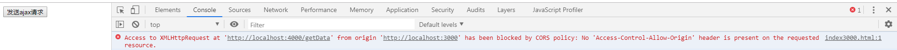

* CORS         
    1. 之前学习jsonp的时候，其实我们已经知道了，4000这边其实能收到我们的请求(如何证明就在4000的那个接口打印一句话，看下日志能不能打印),
      跨域的本质是浏览器的行为，请求是通的，只是浏览器的行为把它阻止掉了，这就是浏览器的同源策略
    2. 前面报错的信息里，其实已经提示我们关键字了`Access-Control-Allow-Origin`，我们在4000项目的index的那个接口里，封印解除下~
        1. 具体代码如下
            ```js
            router.get("/getData", ctx => {
              ctx.set("Access-Control-Allow-Origin", "*");
              ctx.body = {
                  status: 1,
                  msg: "4000 msg"
              }
            })
            ```
        2. 其实核心代码就是`ctx.set("Access-Control-Allow-Origin", "*");`，这里的*表示允许任何地址来访问，这里的操作是设置响应头
        3. 然后我们在操作一把看下能不能收到4000项目的接口数据 

            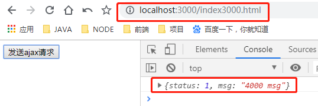 

        4. 其实上述设置用通配符不太好，可以把它改成"http://localhost:3000"，同样可以发送请求成功，我们这边可以在看下network 

            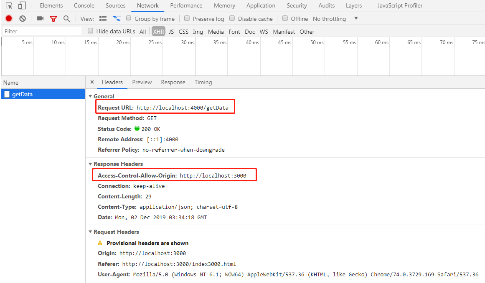

    3. 现在我们来看下简单请求和预检请求
        1. 前面我们简单的跨域请求已经完成了，现在我们给前端添加一个请求头的设置
            ```js
            // xhr.setRequestHeader("content-type", "application/x-www-form-urlencoded")
            xhr.setRequestHeader("content-type", "application/json")
            ```
        2. 我们发现前者设置的内容就没问题，后者设置就报错了

            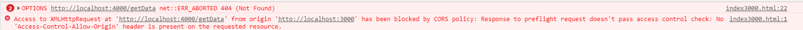

        3. 在知识大纲中罗列了什么是简单请求，如果非简单请求，浏览器的行为会发送一个options的预检请求(请求2次)，因为我们在4000项目中没有options的接口，所以报了404的错 
        4. 所以接下来在4000的项目中添加options接口看下，添加好这个后应该就没有404的错误了 
            ```js
            router.options("/*", ctx => {
                ctx.body = "";
            })
            ```
        5. 然后访问后发现依然报了跨域的错，所以我们和之前一样在添加可以跨域的代码
            ```js
            router.options("/*", ctx => {
                ctx.set("Access-Control-Allow-Origin", "http://localhost:3000");
                ctx.body = "";
            })
            ```  
        6. 然后在点击发送请求，这次就出现了新的错误，关键字是`Access-Control-Allow-Headers`   

            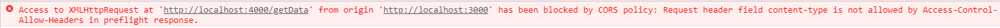

        7. 这个其实就是预检请求已经ok了,但正式请求没通，后端要允许请求头部可以设置哪些属性,所以只要加上就能请求成功了
            ```js
            ctx.set("Access-Control-Allow-Headers", "content-type");
            ``` 
        8. 操作一把，的确符合我们的预期，一个options请求一个get请求，并且返回了我们需要的数据
        9. 在之前的章节里，我们有讲过前端可以获取响应头的数据，具体代码是`xhr.getAllResponseHeaders()`,我们分别看下network中的响应头和我们打印的所有的响应头是否一致

            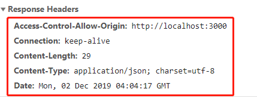

            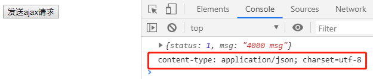   

        10. 我们发现少了很多东西，这个其实也是后端设置后前端可以拿到，我们在get的那个接口里在添加设置，具体代码如下 
            ```js
            //设置响应头的信息，前端可以拿到，这里用date做演示，也可以追加其他的属性
            ctx.set("Access-Control-Expose-Headers", "Date")
            ```
        11. 再次点击按钮看下控制台打印的信息，发现就能拿到Date的值

            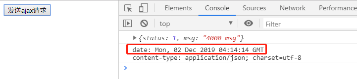   

        12. 响应头有些默认值本来就可以拿到，那些拿不到的要通过`Access-Control-Expose-Headers`设置，详细的请看知识大纲  

    4. delete和put需要预检请求，这边我们一般也都会设置请求方法
        ```
        ctx.set('Access-Control-Allow-Methods', 'PUT, POST, GET, DELETE, OPTIONS');//设置方法
        ```
    5. 允许携带凭证，这里用cookie来演示下(后续章节会在介绍cookie的)
        1. 我们先来同源请求下，在3000的项目下，现在index.js中来个post接口
            ```js
            router.post("/test", ctx => {
                //同源 设置cookie 这里简单演示下，设置的cookie就是 name = test
                ctx.cookies.set("name", "test", {
                    maxAge: 1 * 60 * 60 * 1000 //设置过期时间 1个小时=60分钟=3600秒=3600*1000毫秒
                })
                ctx.body = {
                    name: "test",
                    age: 999,
                }
            })    
            ```
        2. index3000的发送post请求 
            ```js
            let oBtn = document.querySelector("button");
            oBtn.addEventListener("click", e => {
                let xhr = new XMLHttpRequest();
                // xhr.open("get", "http://localhost:4000/getData", true);
                // xhr.setRequestHeader("content-type", "application/x-www-form-urlencoded")
                xhr.open("post", "/test", true); //测试同源cookie
                xhr.setRequestHeader("content-type", "application/json")
                xhr.onload = function(){
                    console.log(JSON.parse(xhr.responseText));
                    console.log(xhr.getAllResponseHeaders());
                }
                xhr.send();
            })      
            ``` 
        3. 然后页面点击发送请求，点击url边上的查看网站信息，在打开看cookie

            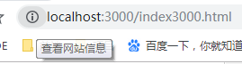

            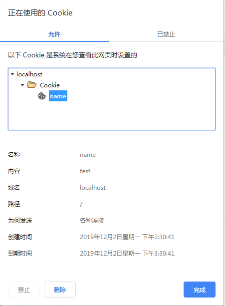

        4. 之后只要发送请求了，都会把cookie带上  

            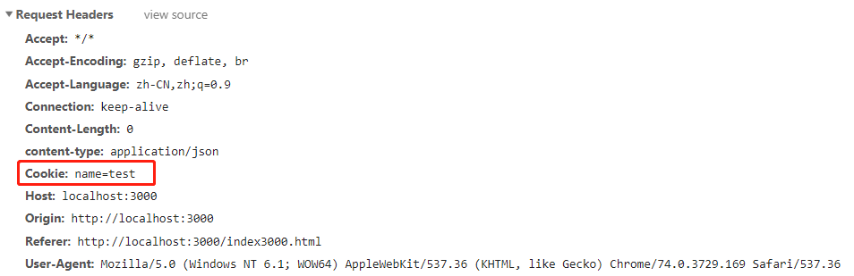

        5. 如果发送跨域的请求这个cookie就没有了，我们在把请求改回跨域的，cookie就带不上了，接下来讲解如何允许携带凭证  
            1. 携带凭证需要前后端配合，前端需要改动后端也需要改动
            2. 先来改下后端，在4000的项目下修改index.js，注意只有post请求才能带上cookie,然后顺便做个优化，使用中间件，
              这样每次设置CORS的东西就只要写一遍就可以了，核心的代码是`ctx.set("Access-Control-Allow-Credentials", true);//允许携带凭证`
                ```js
                const Koa = require("koa");
                const Router = require("koa-router");
                const static = require("koa-static");
                const koaBody = require("koa-body");

                let app = new Koa();
                let router = new Router();

                app.use(static(__dirname + "/static"));
                app.use(koaBody());

                app.use((ctx, next) => {
                  //可以跨域的地址
                  ctx.set("Access-Control-Allow-Origin", "http://localhost:3000");
                  //设置请求头的信息，这里用content-type做演示，可以追加其他的属性
                  ctx.set("Access-Control-Allow-Headers", "content-type");
                  //设置响应头的信息，前端可以拿到，这里用date做演示，也可以追加其他的属性
                  ctx.set("Access-Control-Expose-Headers", "Date");
                  //设置方法
                  ctx.set("Access-Control-Allow-Methods", "PUT, POST, GET, DELETE, OPTIONS");
                  //允许携带凭证
                  ctx.set("Access-Control-Allow-Credentials", true);
                  next();
                });

                app.use(router.routes());

                router.options("/*", ctx => {
                  ctx.body = "";
                });

                router.get("/", ctx => {
                  ctx.body = "hello 4000";
                });

                router.get("/getData", ctx => {
                  ctx.body = {
                    status: 1,
                    msg: "4000 msg"
                  };
                });
                
                router.post("/testData", ctx => {
                    console.log(ctx.request.headers);
                    ctx.body = {
                        status: 1,
                        msg: "test data in 4000"
                      };
                })

                app.listen(4000);
                
                ```
            3. 在改下3000项目的前端index3000.html，核心的代码是`xhr.withCredentials = true; //允许携带凭证`
                ```html
                <!DOCTYPE html>
                <html lang="en">
                <head>
                    <meta charset="UTF-8">
                    <meta name="viewport" content="width=device-width, initial-scale=1.0">
                    <meta http-equiv="X-UA-Compatible" content="ie=edge">
                    <title>Document</title>
                </head>
                <body>
                    <button>发送ajax请求</button>
                    <script>
                        {
                            let oBtn = document.querySelector("button");
                            oBtn.addEventListener("click", e => {
                                let xhr = new XMLHttpRequest();
                                // xhr.open("get", "/getData", true);
                                // xhr.open("get", "http://localhost:4000/getData", true);
                                // xhr.open("post", "/test", true); //测试同源cookie
                                xhr.open("post", "http://localhost:4000/testData", true);
                                // xhr.setRequestHeader("content-type", "application/x-www-form-urlencoded");
                                xhr.setRequestHeader("content-type", "application/json");
                                xhr.withCredentials = true; //允许携带凭证
                                xhr.onload = function(){
                                    console.log(JSON.parse(xhr.responseText));
                                    console.log(xhr.getAllResponseHeaders());
                                }
                                xhr.send();
                            })
                        }
                    </script>
                </body>
                </html>
                ```
            4. 再次访问网站看下是否能携带cookie

                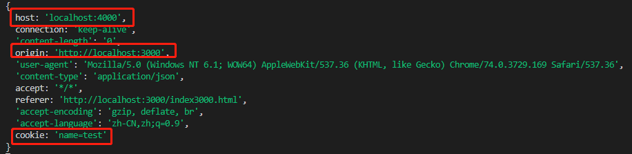 

            5. 我们还可以测下，把前端写的`xhr.withCredentials = true;`注释掉就带不了cookie了  
          
* 服务器代理
  1. 跨域是浏览器的行为，所以服务器代理的原理就是跳过浏览器，直接在后端这里做代理处理，自己的服务器去请求别人的服务器
  2. 我们在3000的static下新建一个proxy.html，这个就用来演示做服务器代理的demo 
  3. 先来做个同源的请求，分别在3000的proxy.html和index.js中加入代码
      ```html
      <!DOCTYPE html>
      <html lang="en">
      <head>
          <meta charset="UTF-8">
          <meta name="viewport" content="width=device-width, initial-scale=1.0">
          <meta http-equiv="X-UA-Compatible" content="ie=edge">
          <title>Document</title>
      </head>
      <body>
          <button>发送请求之服务器代理</button>
          <script>
              {
                  let oBtn = document.querySelector("button");
                  oBtn.addEventListener("click", e => {
                      let xhr = new XMLHttpRequest();
                      xhr.open("post", "/proxyData", true);
                      xhr.onload = function(){
                          console.log(JSON.parse(xhr.responseText));
                      }
                      xhr.send();
                  });
              }
          </script>
      </body>
      </html>      
      ```
      ```js
      router.post("/proxyData", ctx => {
          ctx.body = {
              msg: "proxy - 3000端口的数据",
              status: 1,
          }
      })      
      ```       
  4. 众所周知，同源的访问肯定没有问题，所以通过同源下的这个接口再去跳转另外个服务器下的接口，这里我们使用下传说中的axios，在3000项目下安装下这个模块`yarn add axios -S`，之后require下`const axios = require("axios")`
  5. 接着就可以做服务器代理了
      ```js
      router.post("/proxyData", async ctx => {
          //转发
          let res = await axios({
              method: "post",
              url: "http://localhost:4000/testData"
          })
          //console.log(res);   
          ctx.body = res.data;
      })      
      ```
  6. 打开页面点击操作一把试试~ 

      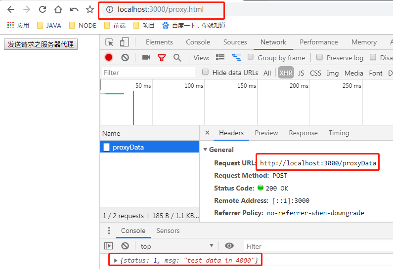

  7. 这样一个简单的服务器代理就实现了，但这个有个不好的地方，相当于每次写个接口就要转发一次，其实有更好的解决方式，可以使用模块"koa-server-http-proxy" 
  8. 老样子我们继续安装这个模块并且引入
      * 安装 - `yarn add koa-server-http-proxy -S` 
      * 引入 - `const koaServerHttpProxy = require("koa-server-http-proxy")`  
  9. 这个核心的代码就是
      ```js
      app.use(koaServerHttpProxy('/api', {
          target: 'http://localhost:4000',
          pathRewrite: { '^/api': '' }
      }))      
      ``` 
  10. 上述代码意思就是当你前端使用"/api"请求的时候，后端会做处理，替换为上述的target值
  11. 所以接着我们来改写下我们3000的前端proxy.html的代码
      ```html
      let oBtn = document.querySelector("button");
      oBtn.addEventListener("click", e => {
          let xhr = new XMLHttpRequest();
          // xhr.open("post", "/proxyData", true);
          xhr.open("post", "/api/testData", true);
          xhr.onload = function(){
              console.log(JSON.parse(xhr.responseText));
          }
          xhr.send();
      });      
      ```
  12. 其实原理和axios是一样的，这样进3000服务器以后直接就转发到4000真正希望请求的接口,结果和之前是一致的，
    就请求有些不一样

      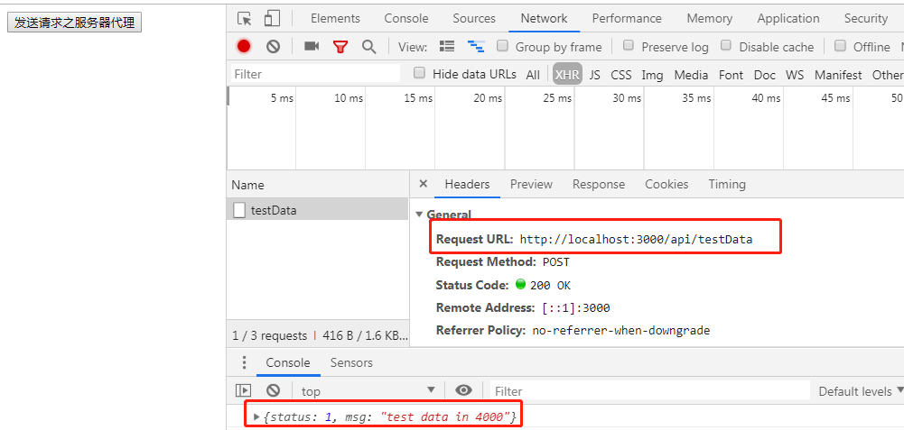    
          

> 知道你不过瘾继续吧
* [目录](../../README.md)
* [上一篇-jsonp原理](../day-21/jsonp原理.md) 
