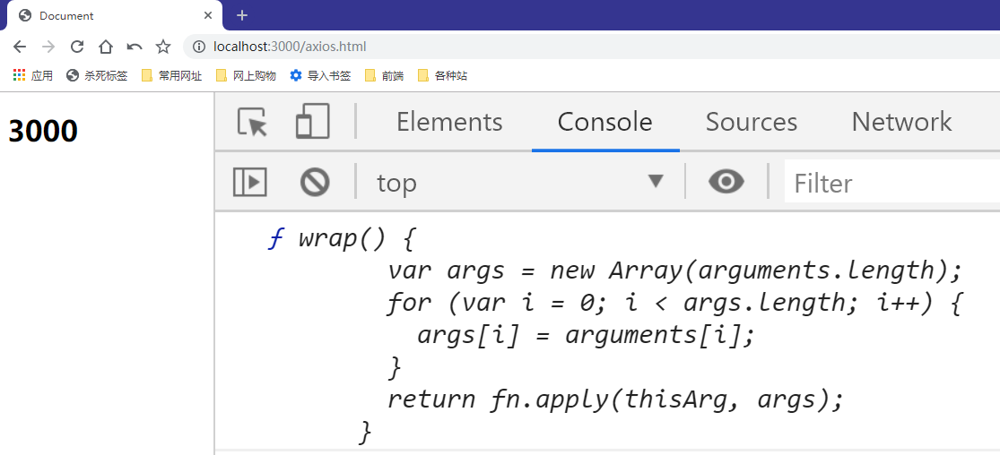
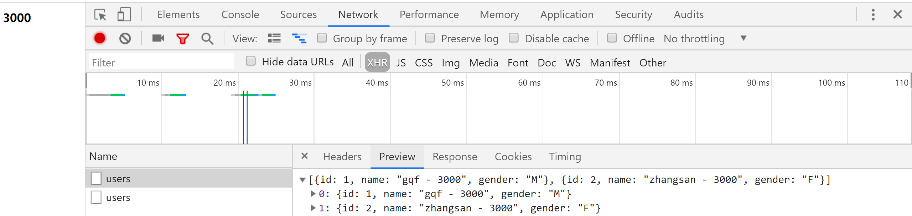

# axios的使用及简单实现

> 知识大纲
* axios的使用，可以参照github上的[axios项目](https://github.com/axios/axios)，也有介绍如何使用
* axios在客户端和服务端都可以使用
* 简单实现个简易的axios

> 练习
* 准备工作
    1. 先安装下axios，使用`yarn add axios -S`
    2. 我们可以看下安装后axios目录下的dist文件，前端客户端使用axios的时候我们要把axios.js放到我们静态文件中
    3. 老样子我们先建2个项目，3000和4000，需要安装koa, koa-router, koa-body, koa-static然后编写服务端代码并且能把项目跑起来，简单写点接口测试下，这里就不赘述了
* axios的使用
    1. 客户端的使用
        1. 在3000项目static文件下新建一个axios.html的文件
        2. 我们这边就简单演示下axios的get请求和post请求
        3. 把之前安装的axios.js放入static文件，在页面中script引入下axios.js,可以打印下axios看下
            ```html
            <!DOCTYPE html>
            <html lang="en">
            <head>
                <meta charset="UTF-8">
                <meta name="viewport" content="width=device-width, initial-scale=1.0">
                <meta http-equiv="X-UA-Compatible" content="ie=edge">
                <title>Document</title>
            </head>
            <body>
                <h1>3000</h1>
                <script src="/axios.js"></script>
                <script>
                    {
                        console.log(axios);
                    }
                </script>
            </body>
            </html>            
            ```
        4. 然后我们就能看到

            

        5. 先来试下get请求,直接干
            ```js
            axios({
                method: "get",
                url: "/users",
            }).then(res => {
                console.log(res.data);
            })

            axios.get("/users").then(res => {
                console.log(res.data);
            })            
            ```
        6. 2种写法，都能请求成功，看下结果    
            
            

    2. 服务端的使用    

> 知道你不过瘾继续吧
* [目录](../../README.md)
* [上一篇-跨域的主流解决方案](../day-22/跨域的主流解决方案.md) 