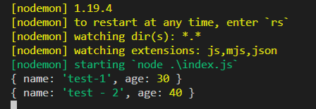
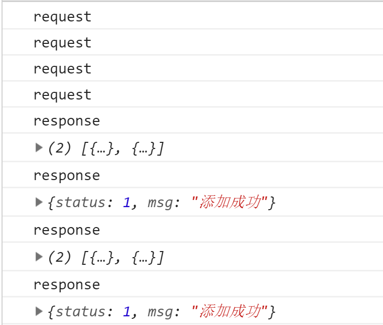
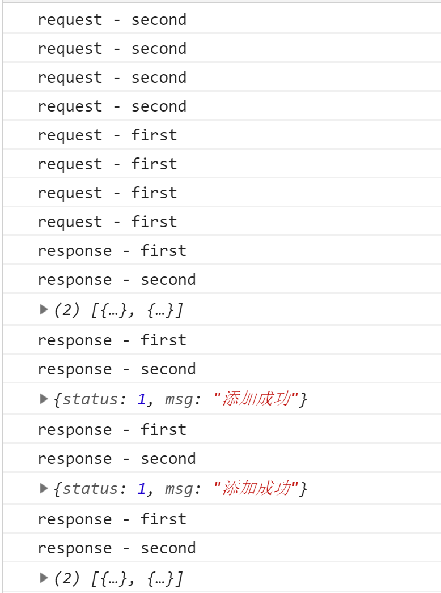
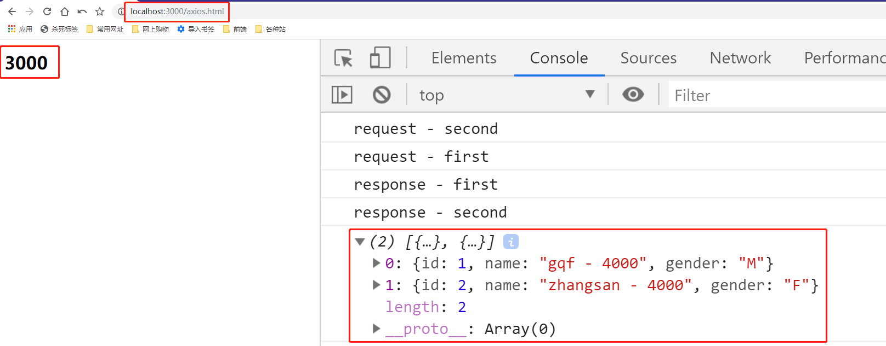

# axios的使用及简单实现

> 知识大纲
* axios的使用，可以参照github上的[axios项目](https://github.com/axios/axios)，也有介绍如何使用
* axios在客户端和服务端都可以使用
* 简单实现个简易的axios

> 练习
* 准备工作
    1. 先安装下axios，使用`yarn add axios -S`
    2. 我们可以看下安装后axios目录下的dist文件，前端客户端使用axios的时候我们要把axios.js放到我们静态文件中
    3. 老样子我们先建2个项目，3000和4000，需要安装koa, koa-router, koa-body, koa-static然后编写服务端代码并且能把项目跑起来，简单写点接口测试下，这里就不赘述了
* axios的使用
    1. 客户端的使用
        1. 在3000项目static文件下新建一个axios.html的文件
        2. 我们这边就简单演示下axios的get请求和post请求
        3. 把之前安装的axios.js放入static文件，在页面中script引入下axios.js,可以打印下axios看下
            ```html
            <!DOCTYPE html>
            <html lang="en">
            <head>
                <meta charset="UTF-8">
                <meta name="viewport" content="width=device-width, initial-scale=1.0">
                <meta http-equiv="X-UA-Compatible" content="ie=edge">
                <title>Document</title>
            </head>
            <body>
                <h1>3000</h1>
                <script src="/axios.js"></script>
                <script>
                    {
                        console.log(axios);
                    }
                </script>
            </body>
            </html>            
            ```
        4. 然后我们就能看到

            

        5. 先来试下get请求,直接干
            ```js
            axios({
                method: "get",
                url: "/users",
            }).then(res => {
                console.log(res.data);
            })

            axios.get("/users").then(res => {
                console.log(res.data);
            })            
            ```
        6. 2种写法，都能请求成功，看下结果    
            
            

        7. 再来看下post的2种写法
            ```js
            axios({
                method: "post",
                url: "/users",
                data: {
                    name: "test-1",
                    age: 30
                }
            }).then(res => {
                console.log(res.data);
            })

            axios.post("/users", {
                name: "test - 2",
                age: 40
            }).then(res => {
                console.log(res.data);
            })            
            ```    
        8. 看下后端的打印情况

              

        9. 关于请求方面就显示这2种，其他的可以详细的看[文档]((https://github.com/axios/axios)   

        10. 接下来还要演示下拦截器, 可以拦截所有的请求或者响应
        11. 先上拦截器代码
            ```js
            //请求之前
            axios.interceptors.request.use(config => {
                console.log('request - first')
                return config;
            })

            //响应之后
            axios.interceptors.response.use(res => {
                console.log('response - first')
                return res;
            })            
            ```  
        12. 我们有2个get请求2个post请求现在看下打印结果 

               

        13. 注意拦截器响应的确是在响应之后，但打印的顺序却并不是这样，是因为请求是个异步的过程，所以需要时间，所以先打印了response在打印了结果，然而实际执行，的确是在响应之后执行拦截器  

        14. 最好玩的是，可以添加多个拦截器，比如我们各加一个请求和响应的拦截器，这样就有2个请求的拦截器，2个响应的拦截器，我们来看下执行的顺序   

        15. 添加多个拦截器具体代码如下
            ```js
            //请求之前
            axios.interceptors.request.use(config => {
                console.log('request - first')
                return config;
            })

            //响应之后
            axios.interceptors.response.use(res => {
                console.log('response - first')
                return res;
            })

            axios.interceptors.request.use(config => {
                console.log("request - second");
                return config;
            })

            axios.interceptors.response.use(res => {
                console.log('response - second')
                return res;
            })            
            ```
        16. 打印的结果如下

            

        17. 客户端axios演示就先到这里，等等会说到axios的简单实现，所以这里先讲一些知识点
            * 混入模式，在请求的时候发现,axios即可以当个函数去使用`axios({....})`，也可以当做对象`axios.get(...)`，这里用的就是混合模式
            * 拦截器的原理，其实是组装了个数组，请求的拦截器，直接往数组里头部添加，即unshift，而相应的拦截器，往数组尾部添加，即push，所以我们看到的请求拦截器的顺序是second，first，而响应拦截器是first，second    

    2. 服务端的使用    
        1. 这里先简单说一句，为什么客户端可以使用axios，服务端也能使用，是因为axios做了适配器
        2. 我们之前其实通过代理服务器做过跨域，其实那个最佳的实现，`koa-server-http-proxy`的原理也是使用axios，这边我们服务端使用axios简单演示下
        3. 我们在3000下的页面，调用ajax取请求4000下的接口，会出现报错的情况，这就是跨域的问题，然后我们直接通过axios去转发，在3000的index.js中，修改下代码
            ```js
            router.get("/users", async ctx => {
                // ctx.body = [
                //     {
                //         id: 1,
                //         name: "gqf - 3000",
                //         gender: "M"
                //     },
                //     {
                //         id: 2,
                //         name: "zhangsan - 3000",
                //         gender: "F"
                //     }
                // ]
                let res = await axios.get("http://localhost:4000/users");
                ctx.body = res.data;
            })            
            ```
        4. 然后看下前端页面打印的结果 

            

        5. 这个就是用axios做代理服务，转发请求，实现了跨域请求的功能   

* axios的简单实现            

> 知道你不过瘾继续吧
* [目录](../../README.md)
* [上一篇-跨域的主流解决方案](../day-22/跨域的主流解决方案.md) 