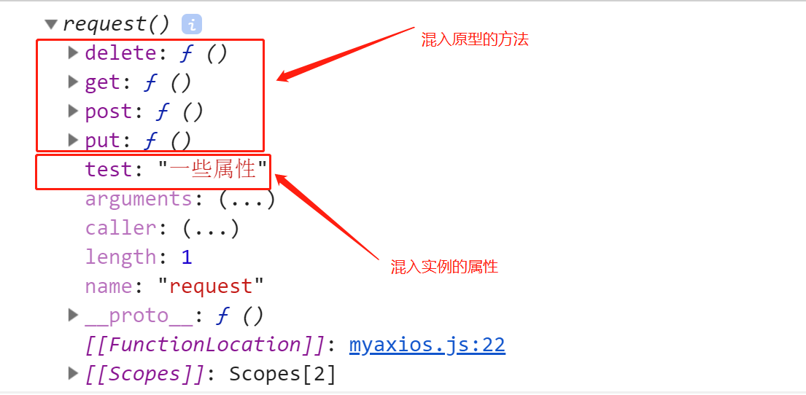

# axios的使用及简单实现

> 知识大纲
* axios的使用，可以参照github上的[axios项目](https://github.com/axios/axios)，也有介绍如何使用
* axios在客户端和服务端都可以使用
* 简单实现个简易的axios

> 练习
* 准备工作
    1. 先安装下axios，使用`yarn add axios -S`
    2. 我们可以看下安装后axios目录下的dist文件，前端客户端使用axios的时候我们要把axios.js放到我们静态文件中
    3. 老样子我们先建2个项目，3000和4000，需要安装koa, koa-router, koa-body, koa-static然后编写服务端代码并且能把项目跑起来，简单写点接口测试下，这里就不赘述了
* axios的使用
    1. 客户端的使用
        1. 在3000项目static文件下新建一个axios.html的文件
        2. 我们这边就简单演示下axios的get请求和post请求
        3. 把之前安装的axios.js放入static文件，在页面中script引入下axios.js,可以打印下axios看下
            ```html
            <!DOCTYPE html>
            <html lang="en">
            <head>
                <meta charset="UTF-8">
                <meta name="viewport" content="width=device-width, initial-scale=1.0">
                <meta http-equiv="X-UA-Compatible" content="ie=edge">
                <title>Document</title>
            </head>
            <body>
                <h1>3000</h1>
                <script src="/axios.js"></script>
                <script>
                    {
                        console.log(axios);
                    }
                </script>
            </body>
            </html>            
            ```
        4. 然后我们就能看到

            

        5. 先来试下get请求,直接干
            ```js
            axios({
                method: "get",
                url: "/users",
            }).then(res => {
                console.log(res.data);
            })

            axios.get("/users").then(res => {
                console.log(res.data);
            })            
            ```
        6. 2种写法，都能请求成功，看下结果    
            
            

        7. 再来看下post的2种写法
            ```js
            axios({
                method: "post",
                url: "/users",
                data: {
                    name: "test-1",
                    age: 30
                }
            }).then(res => {
                console.log(res.data);
            })

            axios.post("/users", {
                name: "test - 2",
                age: 40
            }).then(res => {
                console.log(res.data);
            })            
            ```    
        8. 看下后端的打印情况

              

        9. 关于请求方面就显示这2种，其他的可以详细的看[文档](https://github.com/axios/axios)   

        10. 接下来还要演示下拦截器, 可以拦截所有的请求或者响应
        11. 先上拦截器代码
            ```js
            //请求之前
            axios.interceptors.request.use(config => {
                console.log('request - first')
                return config;
            })

            //响应之后
            axios.interceptors.response.use(res => {
                console.log('response - first')
                return res;
            })            
            ```  
        12. 我们有2个get请求2个post请求现在看下打印结果 

               

        13. 注意拦截器响应的确是在响应之后，但打印的顺序却并不是这样，是因为请求是个异步的过程，所以需要时间，所以先打印了response在打印了结果，然而实际执行，的确是在响应之后执行拦截器  

        14. 最好玩的是，可以添加多个拦截器，比如我们各加一个请求和响应的拦截器，这样就有2个请求的拦截器，2个响应的拦截器，我们来看下执行的顺序   

        15. 添加多个拦截器具体代码如下
            ```js
            //请求之前
            axios.interceptors.request.use(config => {
                console.log('request - first')
                return config;
            })

            //响应之后
            axios.interceptors.response.use(res => {
                console.log('response - first')
                return res;
            })

            axios.interceptors.request.use(config => {
                console.log("request - second");
                return config;
            })

            axios.interceptors.response.use(res => {
                console.log('response - second')
                return res;
            })            
            ```
        16. 打印的结果如下

            

        17. 客户端axios演示就先到这里，等等会说到axios的简单实现，所以这里先讲一些知识点
            * 混入模式，在请求的时候发现,axios即可以当个函数去使用`axios({....})`，也可以当做对象`axios.get(...)`，这里用的就是混合模式
            * 拦截器的原理，其实是组装了个数组，请求的拦截器，直接往数组里头部添加，即unshift，而相应的拦截器，往数组尾部添加，即push，所以我们看到的请求拦截器的顺序是second，first，而响应拦截器是first，second    

    2. 服务端的使用    
        1. 这里先简单说一句，为什么客户端可以使用axios，服务端也能使用，是因为axios做了适配器
        2. 我们之前其实通过代理服务器做过跨域，其实那个最佳的实现，`koa-server-http-proxy`的原理也是使用axios，这边我们服务端使用axios简单演示下
        3. 我们在3000下的页面，调用ajax取请求4000下的接口，会出现报错的情况，这就是跨域的问题，然后我们直接通过axios去转发，在3000的index.js中，修改下代码
            ```js
            router.get("/users", async ctx => {
                // ctx.body = [
                //     {
                //         id: 1,
                //         name: "gqf - 3000",
                //         gender: "M"
                //     },
                //     {
                //         id: 2,
                //         name: "zhangsan - 3000",
                //         gender: "F"
                //     }
                // ]
                let res = await axios.get("http://localhost:4000/users");
                ctx.body = res.data;
            })            
            ```
        4. 然后看下前端页面打印的结果 

            

        5. 这个就是用axios做代理服务，转发请求，实现了跨域请求的功能   

* axios的简单实现 
    * 准备工作
        1. 我们现在3000的项目下，新建一个myaxios.html和myaxios.js
        2. 分别注入灵魂,这里提供下html的代码和js里的代码
            ```html
            <!DOCTYPE html>
            <html lang="en">
            <head>
                <meta charset="UTF-8">
                <meta name="viewport" content="width=device-width, initial-scale=1.0">
                <meta http-equiv="X-UA-Compatible" content="ie=edge">
                <title>Document</title>
            </head>
            <body>
                <h1>myaxios - 自己简单封装下</h1>
                <script src="/myaxios.js"></script>
                <script>
                    console.log("页面直接写的script")
                </script>
            </body>
            </html>            
            ```
            ```js
            console.log("自己封装的axios")
            ```    
        3. 然后打开页面就能看到

            

    * 开始封装简易的axios 
        1. 先来看下原版axios使用时的一个代码
            ```js
            axios({
                 method: "get",
                 url: "/users",
            }).then(res => {
                 console.log(res.data);
            })
            ``` 
        2. 明显这里是个函数，传入了个对象，并且这个函数返回了Promise,所以可以用.then，这里我们先不考虑对象的一些使用(如`axios.get`)
        3. 我们先定义一个Axios的类吧
            ```js
            // console.log("自己封装的axios")
            class Axios{
                constructor(){

                }
                request(){
                    console.log("发送请求")
                }
            }            
            ```   
        4. 如何让axios像函数这样使用，我们可以巧妙的这样写
            ```js
            // console.log("自己封装的axios")
            class Axios{
                constructor(){

                }
                request(){
                    console.log("发送请求")
                }
            }

            function createInstance(){
                let context = new Axios();
                let instance = context.request;
                return instance;
            }

            let axios = createInstance();            
            ``` 
        5. 上述createInstance的函数，就是实例化了Axios，然后返回了实例，这个实例是request方法，但并没有执行，所以现在的axios就相当于Axios类中的request方法，这样写的好处之后我还会在提到，我们先在myaxios页面中尝试调用下`axios()`，然后就能看到控制塔斯就打印了**发送请求**  

            

        6. 接下去我们就让request函数接受个config, 并且返回个Pormise看下结果，然后直接调用前面写的这个
            ```js
            request(config){
                // console.log("发送请求")
                console.log(config);
                return new Promise((resolve, reject) => {
                    resolve("then里面的res")
                })
            }            
            ```
            ```js
            axios({
                 method: "get",
                 url: "/users",
            }).then(res => {
                 console.log(res);
            })            
            ```
        7. 此时打开控制台就能看到 

                

        8. 接下来我们来讲下混合模式，所谓混合模式，就是实现了axios即可以像函数这样执行，也可以像对象这样使用`axios.get`,`axios.post`等执行，其实不同的请求方式，最终调用的还都是request方法 

        9. 我们先在Axios原型上添加这些请求的方式，然后在控制台看下结果
            ```js
            //这里就展示常用的4种
            let methodArr = ["get", "post", "put", "delete"];
            methodArr.forEach(method => {
                Axios.prototype[method] = function(config){
                    config.method = method;
                    return this.request(config)
                }
            })

            console.dir(Axios);            
            ```

            

        10. **混入模式** - 现在就是混入模式最巧妙的地方了，因为先在的axios是个函数，函数也是个对象，所以我们可以这么操作，强行给函数axios加上前面的请求方法
            1. 先定义个混入的工具类
                ```js
                let utils = {
                    extends(a, b){
                        //a是函数, b是原型
                        for (const key in b) {
                            if(b.hasOwnProperty(key)){                
                                if(typeof b[key] === "function"){
                                    a[key] = b[key];
                                }
                            }
                        }
                    }
                }                
                ```
            2. 然后在createInstance函数中使用它
                ```js
                function createInstance(){
                    let context = new Axios();
                    let instance = context.request;
                    //把原型里的几个请求函数混入到instance里面
                    utils.extends(instance, Axios.prototype);
                    console.dir(instance)
                    return instance;
                }                
                ```  
            3. 然后看下我们的控制台，发现混入成功 

                  

            4. 但实际上还有个细节问题，我们在页面中使用`axios.get`测试下  
                ```js
                axios.get({
                    url: "/users",
                }).then(res => {
                    console.log(res);
                })                
                ``` 
            5. 然后就发现有报错了，原因其实是this指向的问题

                

            6. 所以我们在混入的extends方法中在bind改变this指向  
                ```js
                let utils = {
                    extends(a, b, c){
                        //a是函数, b是原型, c是改变this指向的对象
                        for (const key in b) {
                            if(b.hasOwnProperty(key)){                
                                if(typeof b[key] === "function"){
                                    a[key] = b[key].bind(c); //这里改变this指向
                                }
                            }
                        }
                    }
                }                
                ```  
                ```js
                function createInstance(){
                    let context = new Axios();
                    let instance = context.request;
                    //把原型里的几个请求函数混入到instance里面
                    utils.extends(instance, Axios.prototype, context);//这里传入的context就是真正的this指向，需要指向axios这个实例，然后就可以成功调用到request方法
                    console.dir(instance)
                    return instance;
                }                
                ```
            7. 现在我们混入了原型的方法，然后我们这次在混入下属性(constructor里的属性混入)，比如我们在constructor里添加`this.test = "一些属性"`，然后改造下我们的extends方法,因为是属性，所以就不需要在改变this指向了
                ```js
                let utils = {
                    extends(a, b, c){
                        //3个参数 a是函数, b是原型, c是改变this指向的对象
                        //2个参数 a是函数, b是实例
                        for (const key in b) {
                            if(b.hasOwnProperty(key)){                
                                if(typeof b[key] === "function"){
                                    //方法
                                    a[key] = b[key].bind(c);
                                }else{
                                    //属性
                                    a[key] = b[key]; //新的分支，混入属性
                                }
                            }
                        }
                    }
                }                
                ``` 
                ```js
                function createInstance(){
                    let context = new Axios();
                    let instance = context.request;
                    //把原型里的几个请求函数混入到instance里面
                    utils.extends(instance, Axios.prototype, context);
                    //把实例中的属性混入到instance中
                    utils.extends(instance, context);
                    console.dir(instance)
                    return instance;
                }                
                ```  

                

            8. 然后我们这个混入模式就实现好了，到现在为止，我们既可以使用`axios()`，也可以使用`axions.get()`,并且我们也混入了实例的一些属性    


             

        11. 讲好混入模式后，我们就要讲下拦截器是怎么实现的
        12. 先来完善下我们的request方法，这里就需要写ajax那一套原生的东西`xhr`
> 知道你不过瘾继续吧
* [目录](../../README.md)
* [上一篇-跨域的主流解决方案](../day-22/跨域的主流解决方案.md) 